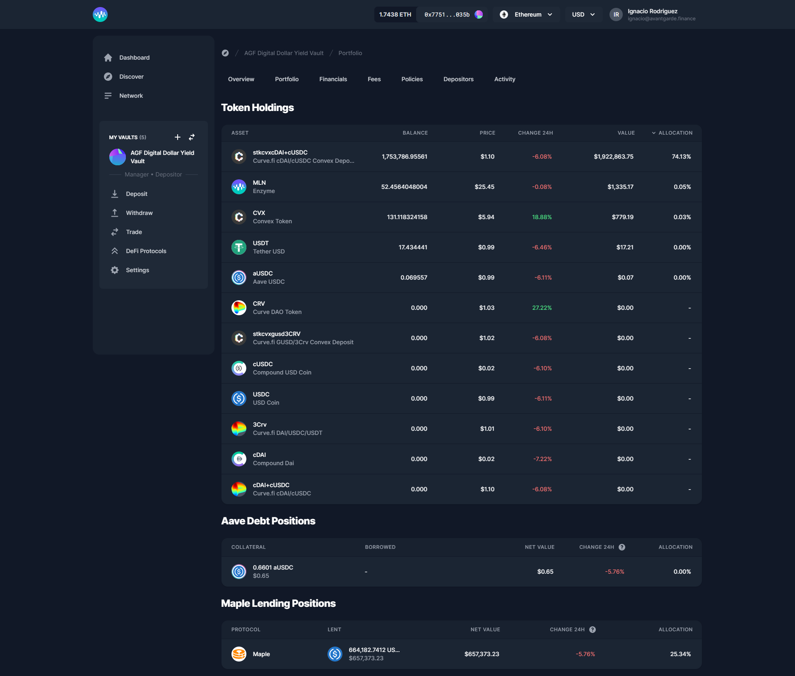

# Browsing Vault Information

Once you've narrowed your search of promising vaults, clicking into the “View Details” button on the vault you want to investigate further will give you a wealth of information. It can be divided broadly into three sections. Before we get into those however, note that all numbers displayed on this page are measured in the currency you've selected in the settings menu in the top right corner of the screen.

### Overview

The top portion of the vault overview page shows you its performance over time, as well as some basic headline information.

The drop-down menu in the top right corner of the chart allows you to show the product's share price or its assets under management. The monthly return table breaks out the performance of the share price into monthly increments (against the currency of your choosing).

### Portfolio

On the portfolio tab, you'll find the vault's current positions.

### **Financials**

.png>)

Investment performance is not just about GAV though. Most investors care about other metrics too. Enzyme calculates these provable metrics from on-chain data. A sample of just a few of the metrics you can get from the financials section can be found in the image below.

* Gross Asset Value (GAV)
* Net Asset Value (NAV)
* Share Supply
* Share Price

**Return Metrics**

* Return Month-to-Date
* Return Quarter-to-Date
* Return Year-to-Date
* Return Inception-to-Date
* Average Month
* Best Month
* Worst Month
* Positive Months
* Length of Track Record

**Risk Metrics (Trailing 30 Days)**

* Annualised Volatility
* Sharpe Ratio

### **Fees**

.png>)

The Fees section lays out exactly how much you'll pay in fees to buy and own shares of this product, as well as the accrued Protocol fees the vault has accumulated.

### Policies

.png>)

On the Policies section, you will see if the vault has any policies such as **Allowed Investors, Investment Limits, Restricted Assets** and others.

### Depositors

Here you will see a list of all vault’s depositors.

### Activity

.png>)

Here you can see the activity from the Vault, deposits, withdrawals, trades, and paid out fees.
