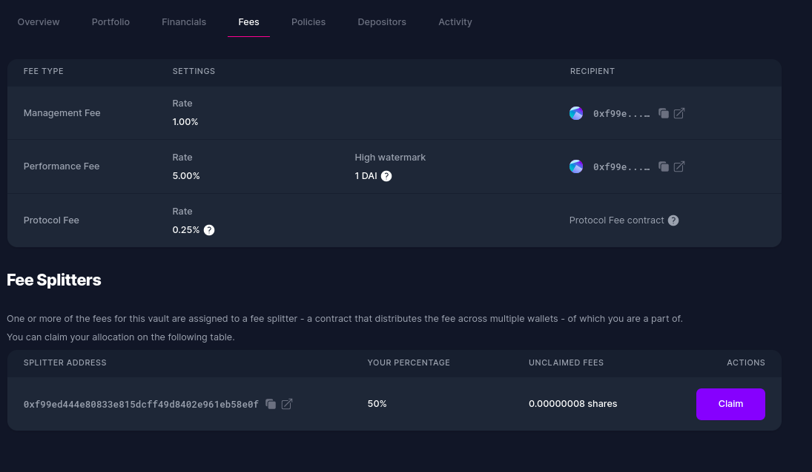

# Fee Splitter

The Fee Splitter is a newly introduced Enzyme feature that allows you to split your fees among several wallets.

### Use cases

Shared asset management: you are sharing the effort of the management with another DeFi strategist and want to split fees with them.

Commercial partnerships: you have a person who is facilitating the onboarding of new depositors and you agree on a certain reward based on new AUM or future performance.

Distribution network: you have a network of allocators/distributors that are cooperating in the success of the DeFi strategy and you want to systemise the fee distribution.

### How to enable the Fee Splitter

The fee splitter is one of our enhanced features so if you are interested in using the Fee Splitter, please reach out our team via email to support@avantgarde.finace

### How to create a Fee Splitter

1\. After reaching out to the Avantgarde Finance team, you will be provided with a link where you can create your own Fee Splitter.

2\. On the top right corner, click on “+ Create fee splitter”.

3\. Add all recipient wallets, specifying the % distribution for each wallet. Note that the total sum must always be 100%. You can split fees up to a maximum of **10 different wallets**.

<figure><figcaption></figcaption></figure>

4\. Once you execute the transaction, the splitter will provide you with a contract address.

<figure><figcaption></figcaption></figure>

### How to connect the Fee Splitter to your vault

**For existing vaults**: to enable the fee splitter you will need to go to Settings > Fees and Fee Splitter. Copy the new address and paste it as the sole recipient of the management, performance, entrance or exit fees. Upon distribution/claim of the fees, the contract will automatically pay out using the underlying pro-rata split.

<figure><figcaption></figcaption></figure>

**For new vaults**, it is easier. We recommend creating the fee splitter contracts first, and then proceeding with the vault creation. As you define vault fees, you’ll need to set the contract address as the only recipient address.

<figure><figcaption></figcaption></figure>

In case you manage several vaults with identical configurations, bear in mind that the splitter contract **can be reused** for more than one vault.

### How to claim fees

<figure><figcaption></figcaption></figure>

Any beneficiary of the fee recipient needs to go to the fee section of the vault, and click on claim fees.


You need to be logged in with the address of the fee recipient.


### **How to update the Fee Splitter**

The fee splitter contract **cannot be updated,** so if you want to change the percentages or add/remove addresses you will need to create a new contract and replace it in your vault settings.

Are you ready to start using the Fee Splitter? Send us your request at **support@avantgarde.finance**.
