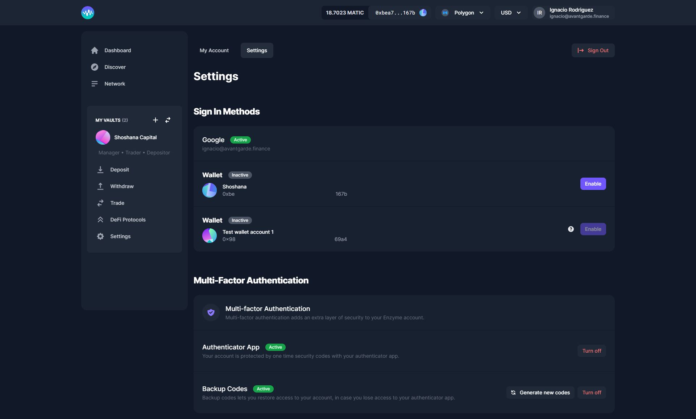

# Set up an Account

Setting up an account is optional. However, setting one up allows us to get in touch with you in case we are performing a bug fix or emergency upgrade. Having an account also allows users to see an aggregate view of all vaults they manage in one central place.&#x20;

## My Account

If you click on your name on the top right corner of your screen, you will see your account details. You can also add wallets to your account here. Adding wallets to your account allows for aggregated views of both your performance as an investor in Enzyme vaults, as well as all of the vaults that you manage.

Here you can personalize and manage your account. From updating your avatar, changing your email address and your name or username, to adding your social media links and website.

## **Settings**

Here you modify your signing methods and you can improve the security of your account, which we highly recommend. You can set up a Multi-Factor Authentication, adding an extra layer of security to your Enzyme account, and please make sure you backup your codes.
