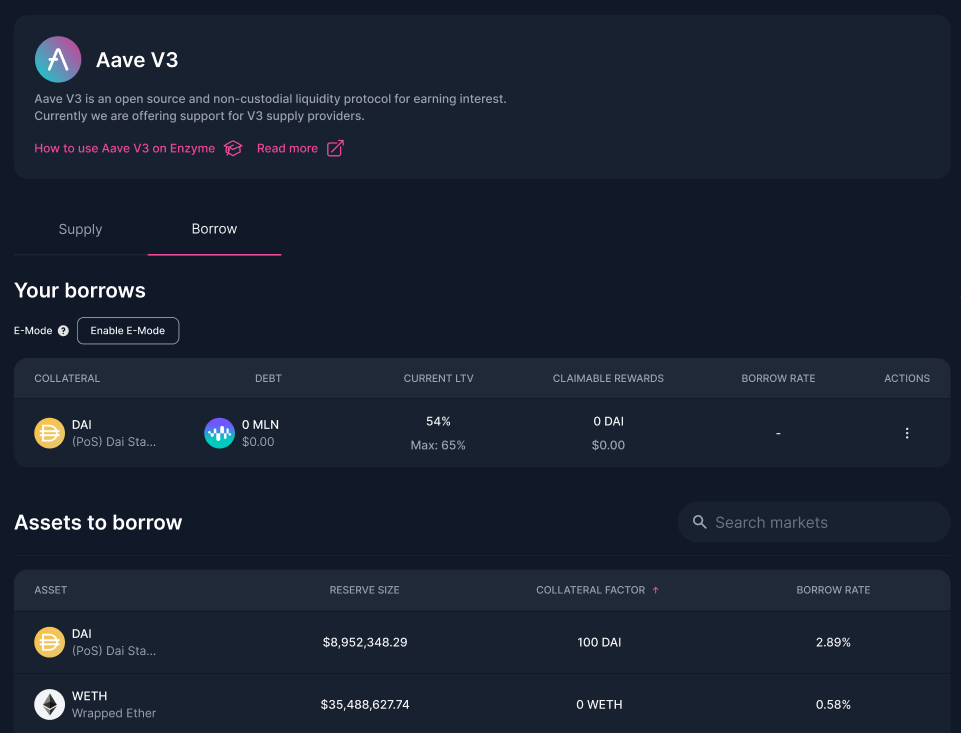

# Aave V3

<figure><figcaption></figcaption></figure>

[Aave](https://aave.com/) V3 is an open-source, non-custodial liquidity protocol designed to earn interest on deposits and facilitate borrowing of digital assets in various modes, including the enhanced E-Mode. Users can deposit funds into liquidity pools, borrow assets against collateral, and maximize their loan-to-value ratio using E-Mode. Aave employs an algorithmic interest rate model to balance supply and demand. With Aave v3, you can supply, claim rewards, and more across both Ethereum and Polygon networks.

With Aave v3, you can **Supply**, **Borrow** and **Claim Rewards**, with a variety of assets in **Ethereum** and **Polygon** networks.

### How to Supply on Aave v3?

1. Navigate to the list of available assets.&#x20;
2. Click on "Supply" next to the asset you wish to lend.&#x20;
3. Enter the desired amount and click on "Supply".&#x20;
4. Review the transaction details.&#x20;
5. Confirm and sign the transaction with your wallet.

### How to Redeem on Aave v3?

1. Navigate to the list of assets you've supplied.
2. Click on "Redeem" next to the desired asset.&#x20;
3. Enter the amount you want to redeem and click on "Redeem".&#x20;
4. Review the transaction details.&#x20;
5. Confirm and sign the transaction with your wallet.

### How to Borrow on Aave v3?

_Note: Before borrowing, Aave v3 tokens must be used as collateral._

1. Go to the "Borrow" tab.
2. Click on "Add Collateral".
3. Input the amount of Aave v3 tokens you wish to use as collateral and click on "Add Collateral".
4. Confirm the transaction details and submit the transaction.&#x20;
5. Once collateral is added, navigate to the list of collaterals.&#x20;
6. Click on the 3 dots beside your collateral and select "Borrow Assets".&#x20;
7. From the dropdown menu, choose the token you want to borrow, specify the amount, and click on "Borrow".&#x20;
8. Review the transaction details.&#x20;
9. Confirm and sign the transaction with your wallet.

### How to **Repay Borrowed Assets** on Aave v3?

1. Navigate to the list of assets you've borrowed.
2. Click on the 3 dots beside the borrowed asset and select "Repay Assets".&#x20;
3. Input the amount you wish to repay and click on "Repay".
4. Review the transaction details.&#x20;
5. Confirm and sign the transaction with your wallet.

### How to **Manage Collateral** on Aave v3?

1. To **Withdraw Collateral**: Navigate to the list of assets you've set as collateral. Click on the 3 dots and select "Withdraw Collateral". Specify the amount, click "Withdraw Collateral", review and confirm the transaction.
2. To **Borrow More Assets**: Follow the steps in the borrowing section after you've added collateral.

### How to **Enabling E-Mode** on Aave v3?

E-Mode allows users to maximize their loan-to-value ratio for specific asset categories up to 97%.

1. Navigate to the "Borrow" tab.
2. Click on "Enable E-Mode".
3. Choose the desired asset category (e.g., Stablecoins, ETH correlated, Matic Correlated). d. Activate "E-Mode".
4. Review the transaction details and confirm.

Note: E-Mode settings can be modified, or it can be disabled entirely. However, changing the mode will impact your loan-to-value ratio.
