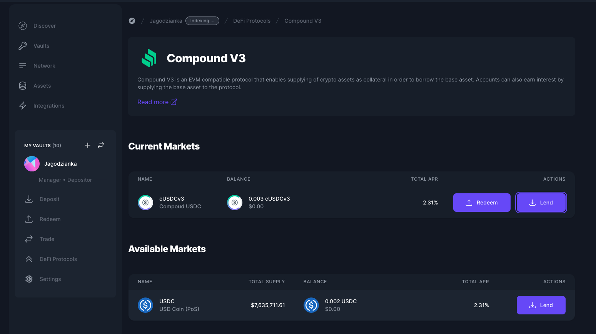

# Compound V3

<figure><figcaption></figcaption></figure>

[Compound](https://compound.finance/) is an algorithmic decentralized finance protocol built on the Ethereum blockchain that allows users to lend and borrow cryptocurrency assets. Compound operates autonomously through smart contracts and enables users to earn interest on their assets through a decentralized lending market.

With **Compound v3**, Enzyme extends this capability to enable **lending** on both **Ethereum** and **Polygon** networks.

### How to Lend on Compound v3?

1. Go to your vault menu on the left-hand side panel and click on "Defi Protocols".
2. Select "Compound v3" from the protocols list.
3. On the Lend tab, search for the asset you wish to lend and click on "Lend".
4. Enter the amount you want to lend and click on "Lend".
5. Review the details of your transaction.
6. Confirm the transaction and sign it with your connected wallet.

### How to Redeem on Compound v3?

1. Go to your vault menu on the left-hand side panel and click on "Defi Protocols".
2. Select "Compound v3" from the protocols list.
3. On the current markets, click on "Redeem" and enter the amount you want to redeem.
4. Review the details of your transaction.
5. Confirm the transaction and sign it with your connected wallet.
