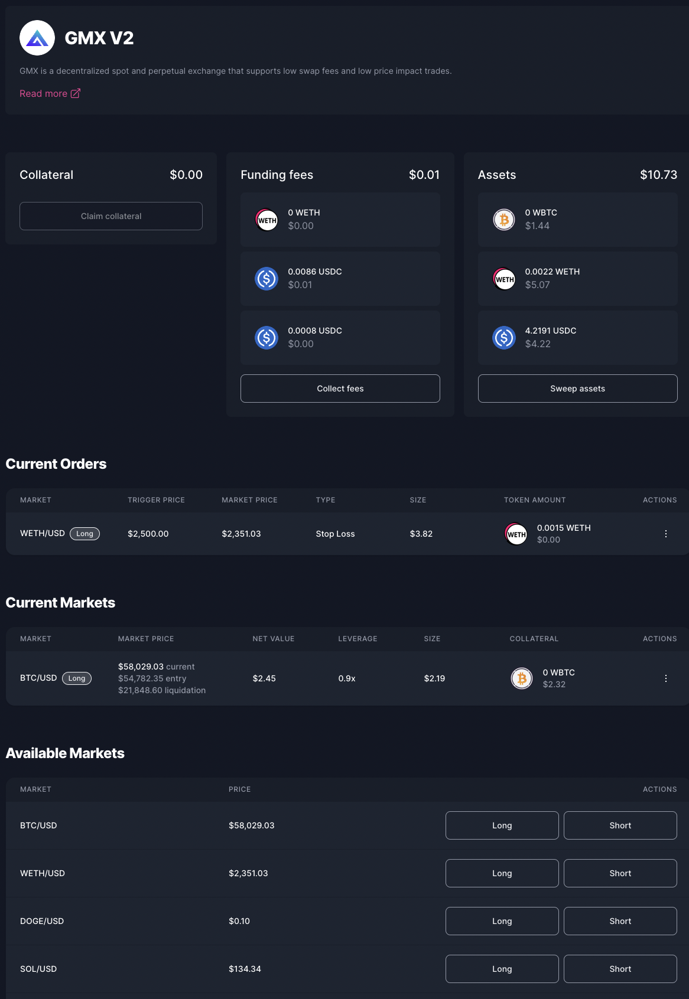

# GMX

<figure><figcaption></figcaption></figure>

[GMX](https://gmx.io/) is a leading on-chain perpetual and spot exchange, allowing you to trade 20+ top cryptocurrencies with up to 100x leverage. Traders on GMX benefit from low fees, deep liquidity, 1-click trading, reduced liquidation risks, multi-collateral support, and a complete suite of trading alerts.

This integration enables vault managers to engage in several key activities within the GMX ecosystem directly from their Enzyme vaults. The integration allows vault managers to participate in **Leverage Trading** which means vault managers can long/short GMX markets with leverage.&#x20;

This integration ensures that vault managers have access to all GMX markets whose underlying assets are part of the Enzyme asset universe, thereby broadening the scope for sophisticated investment maneuvers and enhanced portfolio performance.

## How to Long a Market 

1. Go to your vault menu on the left-hand side panel and click on "Defi Protocols".
2. Select "**GMX**" from the protocols list.
3. In the Available Markets list view, click on "Long" on the chosen Market.
4. Select the pool you would like to participate in, choose the collateral token you wish to deposit, and set your desired leverage.
5. Optionally in the Advanced Settings, you can modify the Slippage
6. Confirm the transaction and sign it with your connected wallet.

## How to Short a Market 

1. Go to your vault menu on the left-hand side panel and click on "Defi Protocols".
2. Select "**GMX**" from the protocols list.
3. In the Available Markets list view, click on "Short" on the chosen Market.
4. Select the pool you would like to participate in, choose the collateral token you wish to deposit, and set your desired leverage.
5. Optionally in the Advanced Settings, you can modify the Slippage
6. Confirm the transaction and sign it with your connected wallet.

## How to Increase size of the Position 

1. Go to your vault menu on the left-hand side panel and click on "Defi Protocols".
2. Select "**GMX**" from the protocols list.
3. In the Current Markets view, click on Actions, for the chosen Position, and click on "Increase size".
4. You have the option to select the amount of collateral you want to deposit into the position, the size of the position you want to increase, or both. The size of the position refers to the value in dollars of your collateral, which GMX uses to determine the leverage.
5. Optionally in the Advanced Settings, you can modify the Slippage
6. Confirm the transaction and sign it with your connected wallet.

## How to Decrease size of the Position 

1. Go to your vault menu on the left-hand side panel and click on "Defi Protocols".
2. Select "**GMX**" from the protocols list.
3. In the Current Markets view, click on Actions, for the chosen Position, and click on "Decrease size".
4. You have the option to select the amount of collateral you want to deposit into the position, the size of the position you want to decrease, or both. The size of the position refers to the value in dollars of your collateral, which GMX uses to determine the leverage. If you withdraw all of your collateral or reduce the entire position size, the position will be closed.
5. Optionally in the Advanced Settings, you can modify the Slippage
6. Confirm the transaction and sign it with your connected wallet.

## How to set the Stop Loss or Take Profit for the Position 

1. Go to your vault menu on the left-hand side panel and click on "Defi Protocols".
2. Select "**GMX**" from the protocols list.
3. In the Current Markets view, click on Actions, for the chosen Position, and click on "Decrease size".
4. You have the option to select the amount of collateral you want to deposit into the position, the size of the position you want to decrease, or both. The size of the position refers to the value in dollars of your collateral, which GMX uses to determine the leverage. If you withdraw all of your collateral or reduce the entire position size, the position will be closed.&#x20;
5.  Choose a Trigger Price, which is the price at which your order will be executed. For a Long position:

    * Setting the Trigger Price above the Current Price places a Take Profit order.
    * Setting the Trigger Price below the Current Price places a Stop-Loss order.

    For a Short position, it works the opposite way:

    * Setting the Trigger Price above the Current Price places a Stop-Loss order.
    * Setting the Trigger Price below the Current Price places a Take Profit order.
6. Optionally in the Advanced Settings, you can modify the Slippage
7. Confirm the transaction and sign it with your connected wallet.

## How to Update the Stop Loss or Take Profit the Order for the Position 

1. Go to your vault menu on the left-hand side panel and click on "Defi Protocols".
2. Select "**GMX**" from the protocols list.
3. In the Current Orders view, click on Actions, for the chosen Order, and click on "Edit".
4. You can modify the Size you want to decrease, the Trigger Price, or both. However, you cannot change the Trigger Price in a way that switches the order type from Stop Loss to Take Profit, or vice versa.
5. Optionally in the Advanced Settings, you can modify the Slippage
6. Confirm the transaction and sign it with your connected wallet.

## How to Cancel the Order for the Position 

1. Go to your vault menu on the left-hand side panel and click on "Defi Protocols".
2. Select "**GMX**" from the protocols list.
3. In the Current Orders view, click on Actions, for the chosen Order, and click on "Cancel".
4. Confirm the transaction and sign it with your connected wallet.

## How to Claim the Collateral 

1. Go to your vault menu on the left-hand side panel and click on "Defi Protocols".
2. Select "**GMX**" from the protocols list.
3. In the Main View, click on "Claim collateral".
4. Confirm the transaction and sign it with your connected wallet.

## How to Collect the Funding Fees 

1. Go to your vault menu on the left-hand side panel and click on "Defi Protocols".
2. Select "**GMX**" from the protocols list.
3. In the Main View, click on "Collect fees".
4. Confirm the transaction and sign it with your connected wallet.

## How to Sweep the Assets 

1. Go to your vault menu on the left-hand side panel and click on "Defi Protocols".
2. Select "**GMX**" from the protocols list.
3. In the Main View, click on "Sweep Assets". These assets are held by the External Position due to Withdrawals, Liquidations, or Execution Fee refunds.
4. Confirm the transaction and sign it with your connected wallet.
