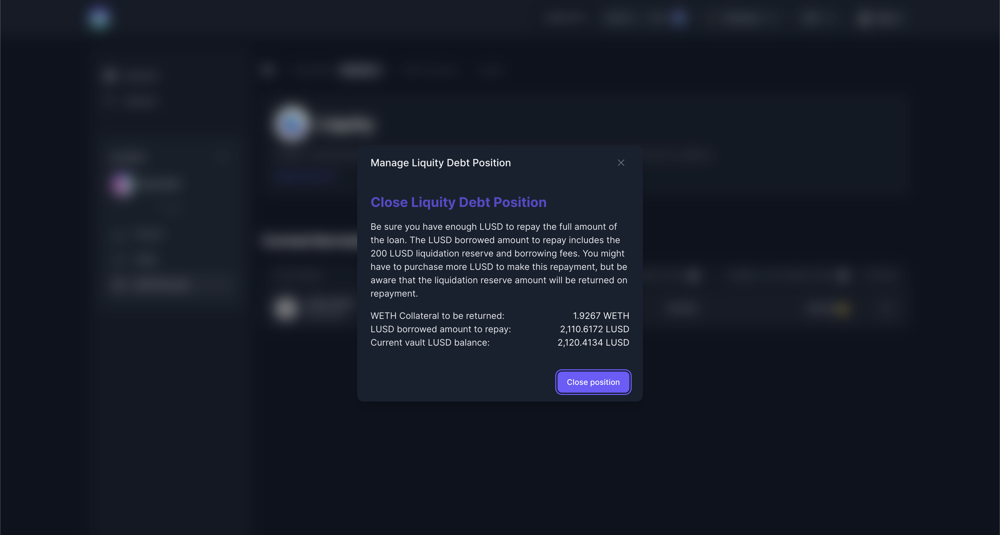

# Liquity

### Zero-interest stablecoin loans with Liquity Troves

Thanks to the new integration with the Liquity protocol, you can now borrow stablecoins at zero interest using ETH as collateral. This is all possible within your Enzyme vault as you can create native Liquity troves directly through Enzyme.

<figure><figcaption></figcaption></figure>

### **Important aspects to consider**

* You can only borrow LUSD and you can only use WETH as collateral.
* The maximum LTV (Loan to Value) on your ETH collateral is 90%. Beyond that point, the ETH collateral gets automatically liquidated by Liquity.
* Liquity has a built-in [**recovery mode**](https://docs.liquity.org/faq/recovery-mode). It is a protocol switch that is designed to prevent systemic risks. When the protocol’s global collateral falls below 150% the recovery mode kicks in, and therefore every loan’s minimum collateral Ratio (CR) jumps from 110% to 150% (or decreases from 90% LTV to 66% LTV respectively). In order to avoid liquidations (especially during Recovery Mode) it is recommended to keep the CR well above 150% / well below 66% LTV at all times.
* You can borrow any LUSD amount starting from a minimum of 2,000 LUSD
* When creating your trove, an additional 200 LUSD is added to your overall debt (borrowed amount + borrowing fees) as a liquidation reserve, to ensure you are able to pay the liquidation fee in case the collateral rate goes beyond the max collateral ratio (110%). The 200 LUSD liquidation reserve is returned once the loan is fully repaid.
* Liquity charges no interest but it does charge a one-time borrowing fee. Borrowers can define the max percentage fee they are willing to pay upfront during the creation of a new loan. It can be set between 0.5% and 5%. The actual fee is algorithmically calculated by Liquity based on redemption activity and time. If the fee is above your accepted fee percentage, the transaction will fail.

### How To Borrow LUSD?

1\. In your left-hand vault menu, go to “DeFi Protocols” and select Liquity.

2\. Click on the three dots and select “Deposit WETH and Borrow”.

3\. Enter the Amount of ETH you would add as collateral (minimum borrow amount is 2000 LUSD and 200 LUSD will be added as a liquidation reserve upon creation), the amount of LUSD you wish to borrow, and the maximum fee you would like to negotiate.

4\. Then click on “Deposit & Borrow”.

<figure><figcaption></figcaption></figure>

### How To Repay Your Liquity Loan?

If you want to repay part of your loan, without closing your Trove, you can.

1\. In your left-hand vault menu, go to “DeFi Protocols” and select Liquity.

2\. Click on the three dots and “Repay LUSD”.

3\. Enter the Amount of LUSD you would like to repay.

4\. Then click on “Repay”.


You need a minimum borrow amount of 2000 LUSD + 200 LUSD as liquidation reserve.


### How To Borrow More LUSD?

1\. In your left-hand vault menu, go to “DeFi Protocols” and select Liquity.

2\. Click on the three dots and “Borrow LUSD”.

3\. Enter the Amount of LUSD you would like to Borrow.

4\. Then click on “Borrow”.


Currently, you cannot borrow an amount that would adjust your collateral ratio below 150%.


### How To Add More Collateral(WETH)?

1\. In your left-hand vault menu, go to “DeFi Protocols” and select Liquity.

2\. Click on the three dots and “Add Collateral (WETH)”

3\. Enter the Amount of WETH you would like to Add.

4\. Then click on “Add Collateral”.

### How To Withdraw Collateral(WETH)?

1\. In your left-hand vault menu, go to “DeFi Protocols” and select Liquity.

2\. Click on the three dots and “Withdraw Collateral (WETH)”.

3\. Enter the Amount of WETH you would like to Withdraw.

4\. Then click on “Withdraw Collateral”.


Currently, you cannot withdraw an amount that would drop your collateral ratio below 150%.


### How To Close Your Liquity Debt Position?

1\. In your left-hand vault menu, go to “DeFi Protocols” and select Liquity.

2\. Click on the three dots and “Close Liquity Loan”.&#x20;

<figure><figcaption></figcaption></figure>

3\. Confirm the details on the image click on “Close Position”.&#x20;


You need to have the necessary amount of LUSD in your vault to repay the loan including the liquidation reserve and fees. Once the loan has been paid the 200 LUSD set apart for the liquidation fee will be returned to the vault.


