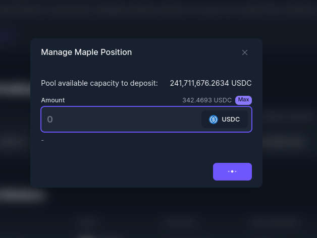

# Maple Finance

[Maple](https://www.maple.finance/) is a capital-efficient corporate debt marketplace allowing institutions to borrow from Liquidity Pools funded by the Defi ecosystem and managed by experienced investors.

With Maple, you can **Lend** to capital markets, available on **Ethereum**.

If you have opened a Maple lending position, there may be restrictions on when and how much of your liquidity you can withdraw. For a full description of the withdrawal process, please see their documentation [here](https://maplefinance.gitbook.io/maple/protocol/liquidity-providers/how-can-i-add-or-withdraw-liquidity).

### How To Lend in Maple?

1\. In your left-hand vault menu, go to “DeFi Protocols” and select Maple.

2\. On the Available Markets, select the Name of the pool you would like to deposit and click on ‘Deposit’.

<figure><figcaption></figcaption></figure>

3\. Enter the amount you wish to deposit and click on ‘Deposit’.

<figure><figcaption></figcaption></figure>

### How To Add More Capital Into A Pool?

1\. In your left-hand vault menu, go to “DeFi Protocols” and select Maple.

2\. On your Current Positions, click on the three dots of the pool you would like to add more capital, and select ‘Deposit’.

<figure><figcaption></figcaption></figure>

3\. Enter the amount you wish to deposit and click on ‘Deposit’.

### How To Withdraw From a Maple Pool?

1\. In your left-hand vault menu, go to “DeFi Protocols” and select Maple.

2\. On your Current Positions, click on the three dots of the pool you would like to withdraw funds, and select ‘Intend to withdraw’.

<figure><figcaption></figcaption></figure>


This transaction will trigger a 10-day cooldown period. After that cooldown period is complete, you will have a 2-day window to withdraw your funds.



Deposits to this Maple pool are locked for 90 days. If you make another deposit to this pool before the 90 days are up, the counter will restart based on a weighted average of your deposits. For example, if you deposit $10m on day 1 and another $10m on day 45, your lockup period on $20m will be 60 days at the time of the second deposit. After this lockup period is finished, you may withdraw your funds via a two-step process. You can read more about the process [here](https://maplefinance.gitbook.io/maple/protocol/liquidity-providers/how-can-i-add-or-withdraw-liquidity#withdraws).


### How To Claim Interest?

1\. In your left-hand vault menu, go to “DeFi Protocols” and select Maple.

2\. On your Current Positions, click on the three dots of the pool you would like to claim interest, and select ‘Claim Interest.

3\. If you have available interest to be claimed, click on ‘Claim Interest’

<figure><figcaption></figcaption></figure>

### How To Claim Rewards?

1\. In your left-hand vault menu, go to “DeFi Protocols” and select Maple.

2\. On your Current Positions, click on the three dots of the pool you would like to claim rewards, and select ‘Claim Interest.

3\. If you have available rewards to be claimed, click on ‘Claim Rewards.

<figure><figcaption></figcaption></figure>
