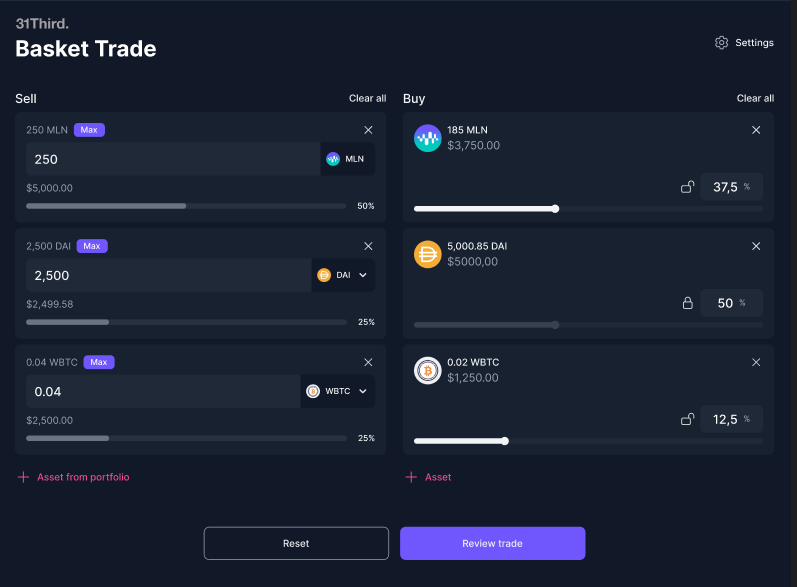

# Basket Trade

<figure><figcaption></figcaption></figure>

The Basket Trade feature on Enzyme, developed by the [31Third](https://31third.com/) team through a dedicated grant, allows vault managers to efficiently execute multi-asset trades and rebalance their portfolios. Leveraging 31Third's advanced trading capabilities, this feature ensures seamless and cost-effective trading within the Enzyme ecosystem.&#x20;

The integration allows vault managers to:

* **Multi-Asset Swaps**: Conduct multi-asset swaps in a single transaction.
* **Portfolio Rebalancing**: Efficiently rebalance your portfolio with automated trade execution.
* **Cost Savings**: Minimize transaction costs with optimized trading strategies.

### How to Basket Trade on Enzyme

1. Go to your vault menu on the left-hand side panel and click on "Basket Trade".
2. From the left panel, select the assets you want to sell with their corresponding amounts.
3. From the right panel, select the assets you want to buy with their corresponding weights.
4. Then click on "Review Trade".
5. Review the trade details and confirm the transaction and sign it with your connected wallet.

### How to adjust the Maximum Slippage

1. Go to your vault menu on the left-hand side panel and click on "Basket Trade".
2. On the top right corner click on "Settings".
3. Enter the new maximum slippage configuration.
4. Proceed with your basket trade.

### How to adjust the Maximum Price Impact

1. Go to your vault menu on the left-hand side panel and click on "Basket Trade".
2. On the top right corner click on "Settings".
3. Enter the new maximum price impact.
4. Proceed with your basket trade.


#### Disclaimer

The Basket Trade feature provides only estimated values based on the user input allocations. Actual trade execution values may vary due to market conditions. Users should review all details carefully before confirming any trades.

