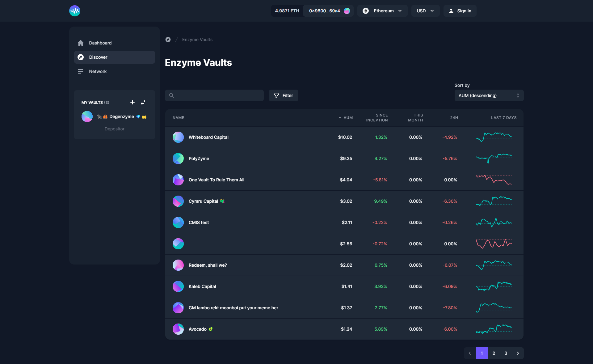

# Browsing the Investor Launchpad

Enzyme allows Vault Managers create vaults that allocate investor funds within the decentralised finance ecosystem. As a depositor, you can buy shares in these products with confidence; the manager's track record is transparent, the rules by which the vault operates and the fees that it charges are written in code, and your funds are always in your custody.

Researching Vaults begins on the Enzyme Discovery page and then goes to the [leaderboard](https://enzyme-frontend.onrender.com/discover/all).

The leaderboard is a list of the best performing Enzyme Vaults. You can sort the leaderboard by various metrics, or further refine the results using the filters.&#x20;

If you find a Vault that looks like it has potential, click on it to go a little deeper with your diligence.&#x20;

