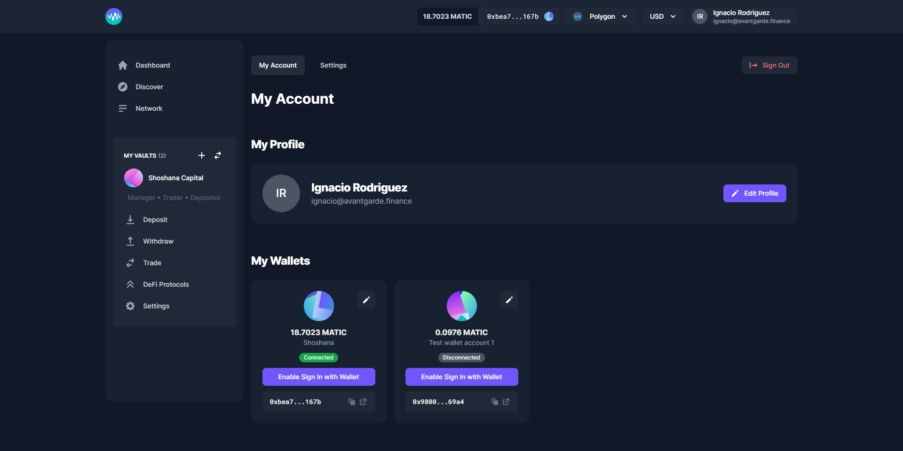
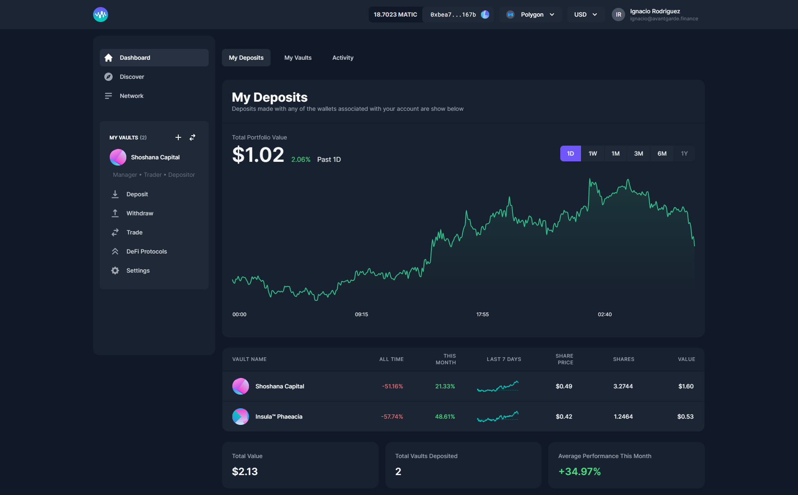

# Browsing the Enzyme Universe

## **Account**

Creating an account is strictly optional, and allows for an aggregate view of the vaults in which you own shares. Simply click the `Sign In` button on the top right corner of the app and follow the prompts to create your account. Once that's done, on the `My Account` tab, you'll be able to add connected wallets. Using these connections, the App can populate the dashboard below.&#x20;

## **Dashboard**

The dashboard is available when you've created an account and logged into the Enzyme app. Here you can see your deposits, vaults you manage and your recent activity.

## **Discover**

Explore the Enzyme universe from the discover page. Here you will get the network status and various vaults that are active across the Enzyme ecosystem. Is a great place to stay up to date with the Enzyme.

****

