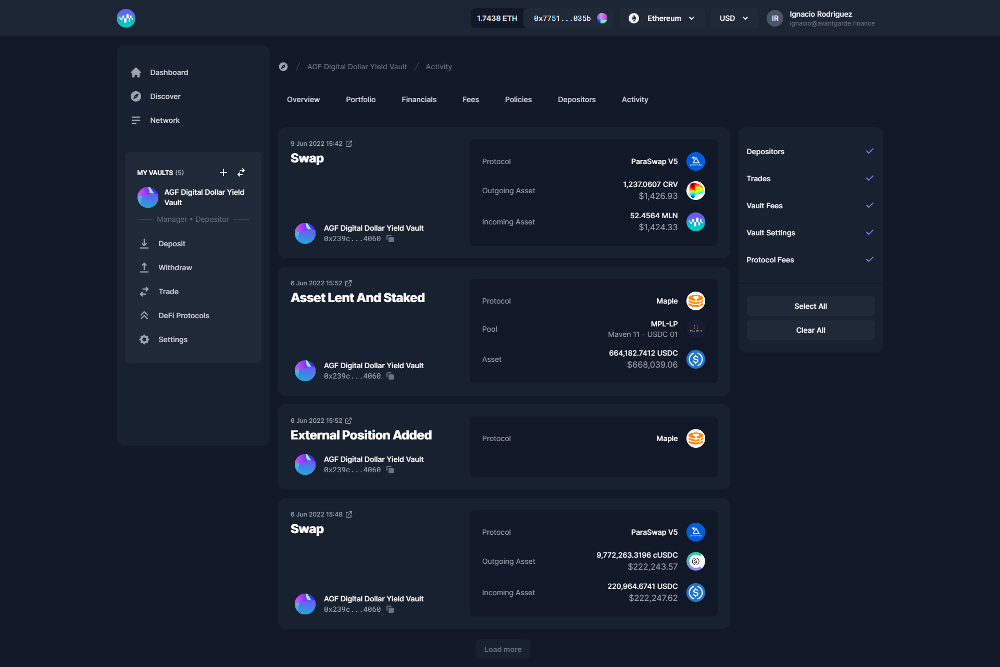

# Vault Menu

## Overview

Your Vault GAV updates in real-time on Enzyme. In other words, you can transparently track historic prices in a provable way. Your performance track record is extremely valuable if you want to scale and monetise.

## Portfolio

Here you can check your positions, which are updated in real-time, including the handling of deposit subscriptions, redemptions, trading, lending, pools and derivatives.&#x20;


Enzyme allows you to track up to 20 assets in your portfolio, this limit is due gas costs. You can always track or untrack new assets from Settings > Asset Managment > Tracked Assets.


## Financials

.png>)

Investment performance is not just about GAV though. Most investors care about other metrics too. The good news is that these are all calculated for you within the Enzyme ecosystem and provable from on-chain data. A sample of just a few of the metrics you can get from the financials section can be found in the image below.

* Gross Asset Value (GAV)&#x20;
* Net Asset Value (NAV)&#x20;
* Share Supply&#x20;
* Share Price

**Return Metrics**

* Return Month-to-Date&#x20;
* Return Quarter-to-Date&#x20;
* Return Year-to-Date&#x20;
* Return Inception-to-Date&#x20;
* Average Month&#x20;
* Best Month&#x20;
* Worst Month&#x20;
* Positive Months&#x20;
* Length of Track Record

**Risk Metrics (Trailing 30 Days)**

* Annualised Volatility&#x20;
* Sharpe Ratio

## **Fees**

.png>)

We talked about fees in the [Set Up](setup/) section. Once you deploy your Vault to main-net, the protocol is continuously calculating and accruing any fees which are owed to the Vault Manager. Typically you'd need a team of expensive accountants or auditors to do this job but this feature is automated and embedded natively in Enzyme's contract logic.

There's more! The Enzyme contracts also enable you to claim your payout as it accrues. To this, just go to your Fee tab in your Vault Menu and scroll down to the Claim Fees section.

Here you will also have an overview of the total Gas, the total Expense Ratio, and the Protocol fees.

## **Policies**

.png>)

Here you see a list of the active policies in your vault.

## **Depositors**

.png>)

Here you see a list of all the depositors in your vault.

## Activity

The activity tab will help you and your depositors review your past actions, whether they involve trade history, claiming or paying fees, changes on your vault settings, new redeemed or minted shares or management of adapters & external positions.

