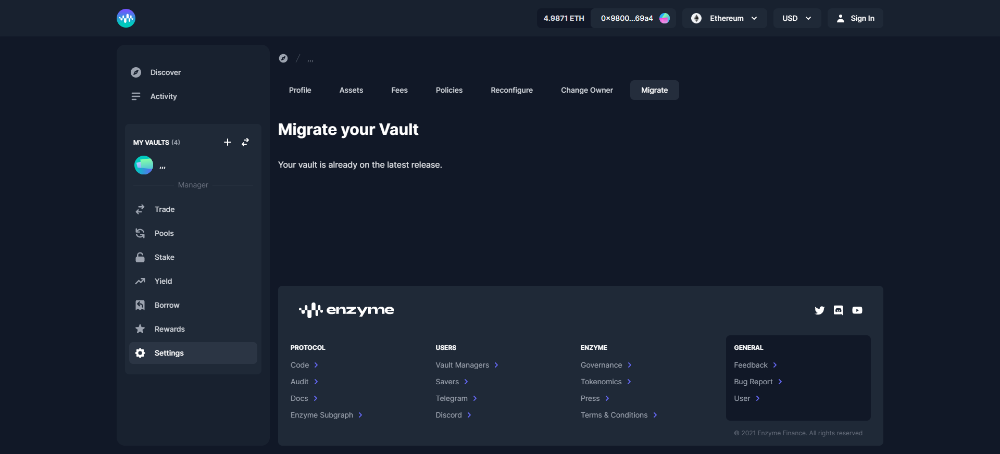

# Customise Vault Settings

Once you've deployed your Vault, you can personalize it via your settings. Settings are much more flexible than configurations and you can change them at any time. To find your settings, you will have to go to the left navigation panel and click on ‘Settings’.

## **Profile**

You have no obligation to share any information about yourself if you don't want to. However, the option is available to you in this section if you’d like to.

## Assets

### **Add Tracked Assets**

Adding tracked assets is a way of telling the protocol to track assets that it doesn’t already know about. By default, new assets are automatically tracked when you trade. However, you may want to add tracked assets to your Vaults which are obtained through other methods such as an airdrop or yield farm. This drop-down allows you to do that.


It is important to note that if you are not tracking assets, they will not be reflected in the GAV which may create an arbitrage opportunity for some investors.&#x20;

As a Vault Manager, it is your responsibility to manage these nuances.


### **Delegate Trading**

You may authorize additional addresses to trade on the vault’s behalf. Note that addresses permissioned in this way will have the authority to manage your positions. You can add these permissions and revoke them at a later date.

## Fees

### Gas Relayer

Enabling the gas relayer allows your vault to pay for the gas of certain transactions. You may only hold up to 0.2 ETH in the Gas relayer.

When disabling the gas relayer, the funds held by the gas relayer will return to the vault.

### Auto Buyback Protocol Shares

This option enables you to claim your protocol fee discount in an automated fashion. See [#enzyme-protocol-fee](../what-is-enzyme/background.md#enzyme-protocol-fee "mention")section for more details about how the fee is applied.

To encourage vault managers to pay the protocol fee in MLN, shares are minted at 50 bps of AUM but can be bought back using $MLN at only 25 bps of AUM ie at a 50% discount.&#x20;

By enabling the Auto Buyback Protocol Shares option your vault can take advantage of paying the lower rate of 25 bps all in one transaction.&#x20;

You’ll need to have $MLN available in your vault to atomically buy back the full amount of protocol fee shares collected during deposits and shares redemption actions.

## Deposit Policies

This section enables a Vault Manager to choose which policies (if any) to impose on deposits. In order to add or change any of these policies, go to the settings of your vault and then select the policies tab. These rules are the same as discussed in the setup section here.


Investor rules that have already been configured can always be edited in the same tab of the Vault Manager Launchpad as per the above screenshot.


### Shares Transferability

Setting shares as freely transferable enforces a permanent guarantee on shares transferability. This transferability guarantee might be required by liquidity pools and other smart contracts that hold/treat shares as generic ERC20 tokens.


Once this setting is enabled, it cannot be disabled, and will persist through migrations and reconfigurations.


### **Allowed Deposit Recipients**

Limits new deposits to a list of addresses. Please note that once a list has been added, will only be able to add or remove new addresses to/from that list. You will not be able to delete the list.

### Allowed Assets For Redemption

This enables your depositors to redeem in a single asset. You can define the asset(s) that are allowed to be included in specific asset redemption.

### Single Asset Redemption Threshold

Defines the assets that are allowed to be included in specific asset redemption

### **Deposit Limits**

You can set Minimum or Maximum deposit limits for your subscribers. Also in this section you can choose to reject all deposits If you chose to reject all deposits, please bear in mind that you will also not be able to deposit into the vault until you change this option back.

### **External Position Removal**

Allows removing an external position from the vault’s activeExternalPositions only if its value can be considered negligible (i.e., dust). The dust threshold is maintained by the Council. This policy allows properly-signalled underlying assets of the external position without a valid price to be valued as 0.

### **Asset Position Removal**

Allows removing an asset from the vault’s tracked assets only if a) it does not have a valid price or b) its value can be considered negligible (i.e., dust). The dust threshold is maintained by the Council.

## Reconfigure your Vault

Reconfiguring your vault is very similar to a migration in that there is a time-lag of 7 days before it takes effect before the new configuration replaces the old one. This is to give stakeholders time to opt-out if they don’t agree to accept the terms of the new configuration.

## Change Owner

There may be some use-cases where you’d want to change the vault owner (eg. moving it to a multi-sig, retiring with a succession plan, etc). In that case, you can use this form to change the vault owner. Ownership transfer is a 2-step process. First, nominate a vault owner using this form. To complete the vault ownership change, the nominated vault owner will need to claim the ownership of the vault. Once the ownership change is claimed, you will lose all owner privileges for this vault.

## Migrate your Vault

If you want to opt-in to a new release of Enzyme you can do so by migrating to the latest version. We will never force you to do this. However, we will not maintain old versions for longer than a fixed period which will be communicated through our official channels. From this drop-down, you will be able to accept and execute your vault migrations.
