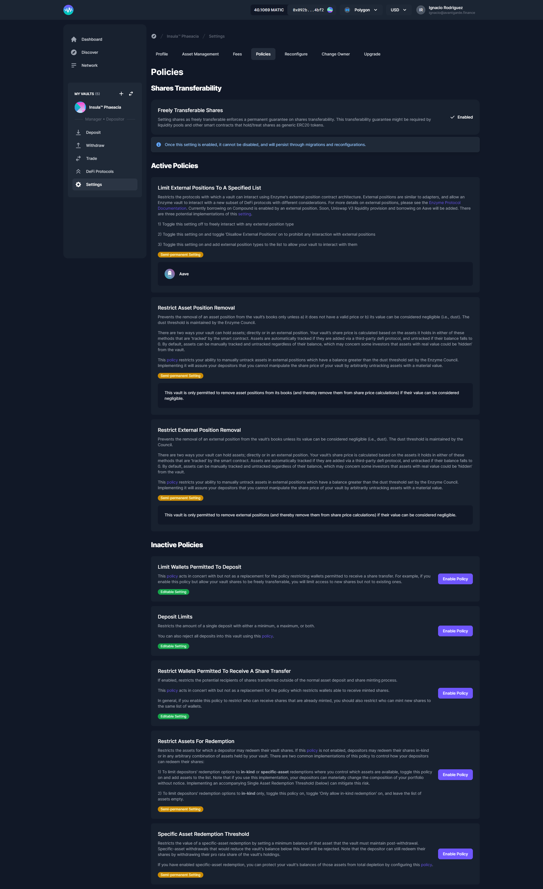

# Policies

This section enables a Vault Manager to choose which policies (if any) to impose on deposits. In order to add or change any of these policies, go to the settings of your vault and then select the policies tab. These rules are the same as discussed in the setup section here.


Investor rules that have already been configured can always be edited in the same tab of the Vault Manager Launchpad as per the above screenshot.


### Shares Transferability

Setting shares as freely transferable enforces a permanent guarantee on shares transferability. This transferability guarantee might be required by liquidity pools and other smart contracts that hold/treat shares as generic ERC20 tokens.


Once this setting is enabled, it cannot be disabled, and will persist through migrations and reconfigurations.


### **Limit Wallets Permitted To Deposit**

Limits new deposits to a list of addresses. Please note that once a list has been added, will only be able to add or remove new addresses to/from that list. You will not be able to delete the list.

### Limit External Positions To A Specified List

Restricts the protocols with which a vault can interact using Enzyme's external position contract architecture.

### Restrict Assets For Redemption

Restricts the assets for which a depositor may redeem their vault shares.

### **Specific Asset Redemption Threshold**

Defines the assets that are allowed to be included in specific asset redemption

### **Deposit Limits**

You can set Minimum or Maximum deposit limits for your subscribers. Also in this section you can choose to reject all deposits If you chose to reject all deposits, please bear in mind that you will also not be able to deposit into the vault until you change this option back.

### **Restrict External Position Removal**

Allows removing an external position from the vault’s activeExternalPositions only if its value can be considered negligible (i.e., dust). The dust threshold is maintained by the Council. This policy allows properly-signalled underlying assets of the external position without a valid price to be valued as 0.

### **Restrict Asset Position Removal**

Allows removing an asset from the vault’s tracked assets only if a) it does not have a valid price or b) its value can be considered negligible (i.e., dust). The dust threshold is maintained by the Council.

### **Restrict Wallets Permitted To Receive A Share Transfer**

If enabled, restricts the potential recipients of shares transferred outside of the normal asset deposit and share minting process. **** This [policy](https://docs.enzyme.finance/managers/setup/share-transfers) acts in concert with but not as a replacement for the policy which restricts wallets able to receive minted shares.

### Allowed adapters per manager

This policy specifics the list of adapters the delegated trader/assigned manager can interact with using vault funds.

### Allowed external position types per manager

This policy specifics the type of external positions the delegated trader/assigned manager can interact with using vault funds.
