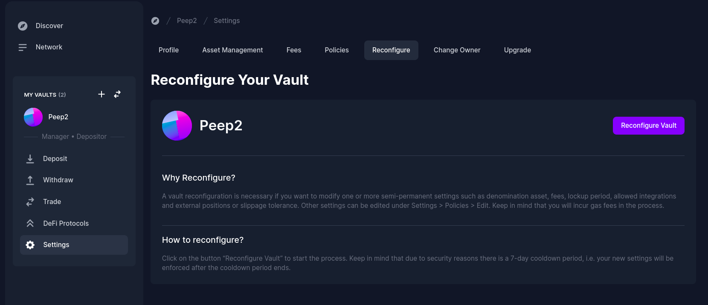

# Reconfigure your Vault

A vault reconfiguration is necessary if you want to modify one or more semi-permanent settings such as denomination asset, fees, lockup period, allowed integrations and external positions or slippage tolerance. Other settings can be edited under Settings > Policies > Edit. Keep in mind that you will incur gas fees in the process.

**How to reconfigure?**

Click on the button “Reconfigure Vault” to start the process. Keep in mind that due to security reasons there is a 7-day cooldown period, i.e. your new settings will be enforced after the cooldown period ends.
