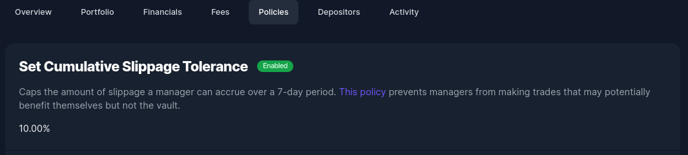

# Risks and Nuances

For any questions about these issues, our team is always happy to [help](https://t.me/enzymefinance).

## Smart Contract Risk

When interacting with any smart-contract protocol, there is always some degree of risk that an edge case or code vulnerability can result in funds being lost. We take security very seriously and have extensively engaged multiple auditors across every release of new code, and maintain a comprehensive unit and integration testing suite.&#x20;

It’s important to note that despite these precautions, there is still a risk that some edge case or bug exists which could result in user funds being lost. You can review the latest audit report [here](https://audit.enzyme.finance).

## Oracle Risk

Enzyme relies on oracles to calculate the GAVs of any investment product. If these oracles are compromised in any way, they can provide attack vectors to users which could lead to a loss of funds.

## Untracked Assets

If assets appear in a Vault which were not acquired through trading, they will be _untracked_ by the Vault and therefore not reflected in the pricing (GAV, NAV) of the Vault. Examples of when this could happen include airdrops or when a Vault Manager claims assets owed from yield farming. In order to make these assets "trackable" by the Vault, you should add them assets to Tracked Assets from your settings page. Note that as long as these assets are not claimed, the Vault may be arbitraged. It is therefore advisable that you either leverage the suite of policies available (eg. the [`Buy Shares Caller Whitelist`](https://app.gitbook.com/@avantgarde-finance/s/user-docs/\~/drafts/-MUCyoZBRNvCvYovCwoq/managers/setup/investments-advanced) or a [`whitelist`](https://app.gitbook.com/@avantgarde-finance/s/user-docs/\~/drafts/-MUCyoZBRNvCvYovCwoq/managers/setup/investments)) to mitigate these risks.

## Asset Risk

It is the Portfolio Manager's responsibility to stay on top of any nuances surrounding tokens. The available asset universe is not intended to be any list of endorsement. Things to look out for could include the risk of token migrations, deviations from the ERC-20 standard, the degree of centralised custodial risk (eg. USDT) and how prices are derived (for example, we use the BTC/ETH rate for WBTC).&#x20;

## Number of Positions

You can hold up to 20 positions in any Enzyme product. Note that gas costs required to operate (eg. investments, trades, etc) increase as the number of assets you hold increases.

## Farming Rewards

A few things to note if farming is part of your Vault strategy.

* When you have unclaimed tokens, your Vault potentially becomes a target for arbitrageurs (at the expense of other depositors in your Vault). We would recommend that you either claim them regularly or use a whitelist to prevent malicious actors.
* Once you have claimed your rewards (in this case, COMP), the position won't update in your overview until either you do a trade or you receive a new deposit. However, your Vault's NAV will no longer be open to arbitrage until substantial rewards accrue.
* If you think that you'll only be claiming rewards once a week, it might make sense to use an entrance fee to deter arbitrageurs.

## External Positions


It is important to note that a vault which is able to interact with external positions requires a much higher degree of trust.&#x20;

It is possible some or all of the funds  get temporarily or permanently locked into the vault.

We strongly recommend that public vaults with unknown managers do not interact with external positions. This is the recommended option in the template we provide.


## Pricing Risk

**Fund owners and asset managers must be aware of the pricing mechanism assumptions and vulnerabilities involved in the assets they hold if their investors are unknown/untrusted entities.** This is because a fund is potentially exposed to share price arbitrage to the extent that Enzyme's understanding of the value of its holdings deviates in value from what can actually be acquired by trading or redeeming those assets.&#x20;

In other words, one of the scenarios below could occur and cause a material impact to the real value held by your vault that is not immediately reflected in the price of your vault's shares.

### Example: Wrapped or synthetic assets using a Chainlink price

With many wrapped assets (e.g., wBTC, cxDOGE, and Lido stETH) and potentially synthetic assets (none currently), the protocol assumes that the asset (e.g., wBTC) maintains a 1:1 price with its underlying (e.g., BTC).

In the case of wrapped assets, the underlyings are held in custody by a third party (e.g. Bitgo, in the case of wBTC, or the Lido smart contract in the case of stETH). If access to the assets is lost by the custodying entity (e.g., contract vulnerability or private key compromise), the protocol will continue to treat the wrapper as 1:1 with its underlying, even though its real value would be between 1 and 0.

The same would be true of a collateralized synthetic asset that became under collateralized.

A full list of assets where a 1:1 assumption is used will soon be available in documentation and the Enzyme app.

### Example: Assets that rely on external protocol assumptions

For example, Curve stablecoin pools rely on the assumption that all assets in the pool are generally worth the same (this is a simplification but is directionally accurate). The price feed used for those tokens within Enzyme would become unstable if any of the assets in the pool lost its peg (which would lead to a "bank run" of sorts, imbalancing the Curve pool).

### Example: Assets that rely on external protocol security

For example, the [YearnVaultV2PriceFeed](broken-reference) that is used for pricing yVault tokens relies on its yVault contract correctly reporting its value in a way that cannot be manipulated by price oracle manipulation attacks.

## Slippage

Slippage in DeFi is the difference between the expected amount of a transaction and the actual amount at which the transaction is executed. There are two types of slippage:

1. Type 1 refers to the value loss incurred in a trade when there is a discrepancy between the DEX price (e.g. Uniswap) and the current asset prices that Enzyme sources from Chainlink. This may happen especially in case of a large-volume trade.
2. Type 2 slippage attributes the value loss to the changing price of a trade between the time when a transaction is sent and the time it is mined. This can happen if there are other trades happening on a given DEX at the same time.

By default the Enzyme app is configured to allow a slippage threshold of up to a 3% but this parameter can be customised before submitting the transaction. In order to modify the threshold, you must click on Advanced Options > Maximum slippage and enter the desired % of slippage. Be aware that manually reducing the slippage tolerance below the default threshold may result in failed transactions.

Also, trading slippage % may differ across decentralised exchanges depending on the relative levels of liquidity for the required token swap. By default the Enzyme app shows you the best trading price among the several options available. This is the power of aggregation of the Enzyme protocol. You can always see “Best price” on top of the list, as illustrated in the screenshot below.

<figure><figcaption></figcaption></figure>

Bear in mind that this Maximum Slippage will only cover Type 1 slippage, as defined above. However, The Cumulative Slippage Tolerance Policy will cover both Type 1 and Type 2 as it will account for cumulative slippage value over time, and will also let the accumulated slippage value diminish over time.

<figure><figcaption></figcaption></figure>

Slippage occurs mostly when you are swapping tokens, so here you can find a list o the Enzyme DeFi integrations where slippage is relevant:

**DEX protocols where you can incur in slippage:**

* Curve Trading
* Paraswap Trading
* Uniswap V2 & V3 Trading

**DeFi Integrations with no slippage:**

* Aave&#x20;
* Compound&#x20;
* Convex&#x20;
* Staking&#x20;
* Idle&#x20;
* PoolTogether

