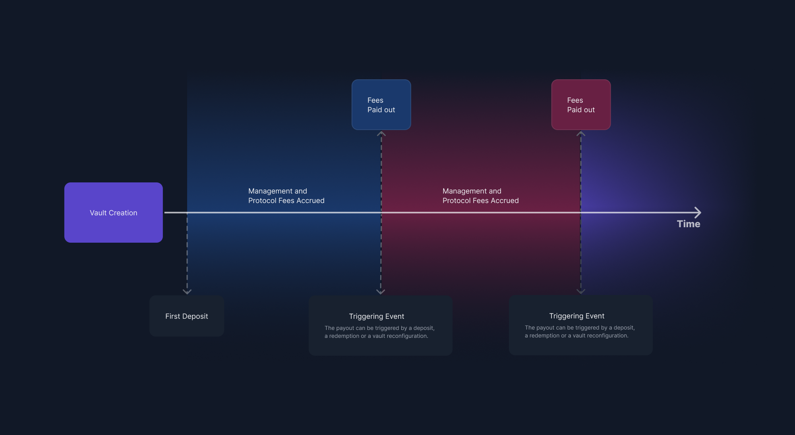

# Fees

Fees are optional and can be charged to anyone depositing into your Vault. All fees detailed in this section are paid out in newly created shares. There are four types of fees you can select as a Vault Manager, detailed below.&#x20;

.png>)


Note that in the screenshot, all fees are toggled on for display purposes. If you do not plan to charge a fee, make sure it is toggled off.


### Management Fees

A management fee is a periodic payment that is paid by product subscribers to the Vault Manager. The fee is calculated as a percentage of assets under management and is independent of Vault returns. More detailed information on how this is calculated at a protocol level can be found [**here**](https://specs-v3.enzyme.finance/fee-formulas/management-fee).

### Performance Fees

Performance Fees for pre-Sulu releases include the concept of a “crystallisation period”. While this concept is important in traditional finance, it is also complicated and gas-expensive to properly implement on-chain. By removing the concept of “crystallisation period”, we can greatly simplify the implementation of the performance fee in the protocol.\
\
Without a "crystallisation period" the manager can potentially earn more performance fees through continuous accrual instead of quarterly or yearly accrual. Managers should therefore set the rate for the new simplified performance fee lower than the rate of the previously used performance fee.\
\
This also implies that performance fee can be claimed at any time.&#x20;

Vault returns are initially benchmarked against `1`. For every period thereafter, the benchmark is reset to what is known as a High Water Mark (HWM). The HWM is the product GAV at the time the performance fees are paid out.\
&#x20;\
If you receive subscribers when GAV is below HWM, they will pay zero performance fees until GAV is back above the HWM. \
\
Subscribers who enter when the product is above HWM  will pay no fees if the fund ends the period below HWM.

More detailed information on performance fees can be found [here](https://app.gitbook.com/@avantgarde-finance/s/enzyme-protocol-v2-general-spec/fee-formulas/performance-fee).

\
You can find below a visual representation of how and when fees are accrued.

<figure><figcaption></figcaption></figure>

### Entrance Fee

An additional entrance fee can be charged to subscribers by the Vault Manager. This can be defined as a percentage of the total investment and can be configured to be paid to the Vault itself or directly to the Vault Manager.

### Exit Fee

In this release, we introduced the option to set up an exit fee, which is charged with every [redemption](redemptions.md). The fee can be set up to be routed to either the Vault or to the Vault Manager.

Additionally, the exit fee can be tiered such that single-asset redemptions are charged a different rate than in-kind redemptions. This incentivizes in-kind redemptions and subsidizes the vault or manager for the extra effort required to manage single-asset redemptions. More discussion around redemption settings can be found at the link above.


**Why have an entrance or exit fee?** Such a fee could deter traders from subscribing and then redeeming in the same transaction to capture possible arbitrage opportunities which may arise. Such an attack would come at the expense of long-term depositors.&#x20;


## ****
