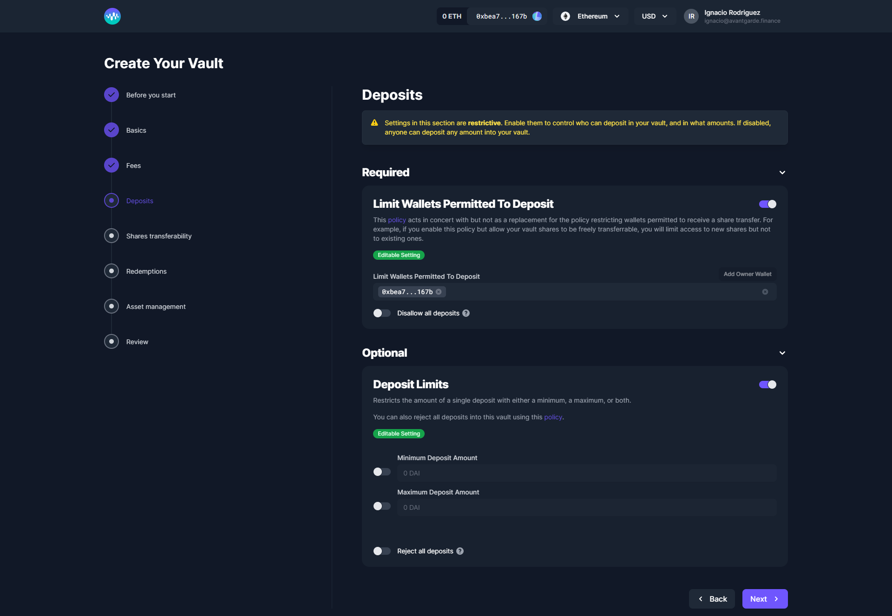

# Deposits

The configurations listed below are **optional** depending on the vault type you have previously selected. They limit who can deposit into your Vault, and how much they can deposit.&#x20;


Note that in the screenshot, all deposit configurations are toggled on for display purposes. If you do not plan to restrict investments using these configurations, make sure they are toggled off.


### **Limit Wallets Permitted To Deposit**

Limits new deposits to a list of addresses. Please note that once a list has been added, will only be able to add or remove new addresses to/from that list. You will not be able to delete the list.&#x20;

It is also worth noting that limiting the wallets that are permitted to make deposits does not automatically limit the wallets that can receive shares via transactions in secondary markets as discussed in the [next section](share-transfers.md). To fully control the ownership of your vault's shares, you need to configure both settings.

### **Deposit Limits**

You can set Minimum or Maximum deposit limits for your subscribers.&#x20;

Also in this section you can choose to reject all deposits. If you chose to reject all deposits, please bear in mind that as vault manager you will also be prevented from depositing into the vault until you disable this option.
