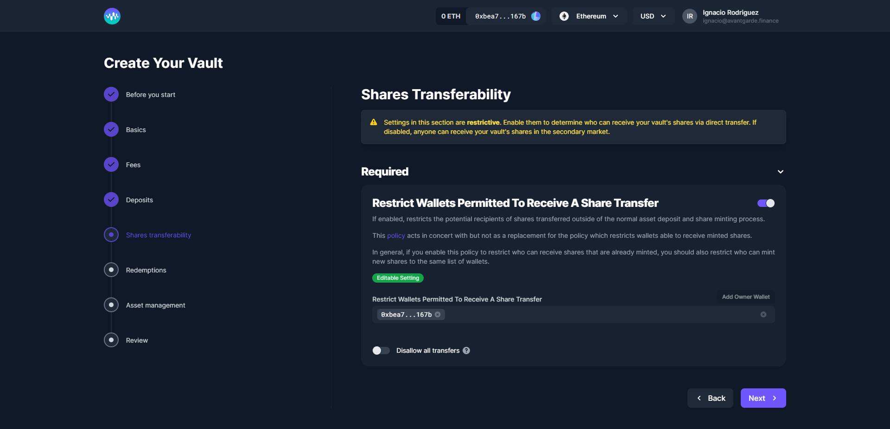

# Share Transfers

Share Transfers can be subject to restrictions, such as limiting which wallets can receive transferred shares.

### Restrict Wallets Permitted To Receive A Share Transfer

Here you can specify addresses to which your vault's shares can be transferred. By default, if this setting is enabled the owner address is always listed. If this setting is toggled off, shares can be transferred freely and used throughout the DeFi ecosystem.&#x20;
