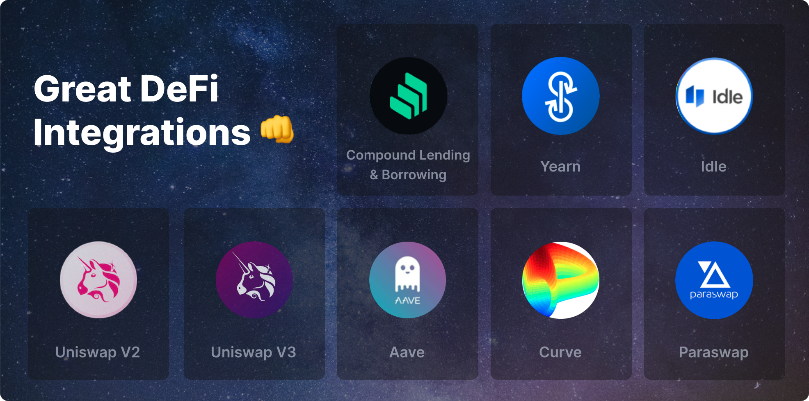
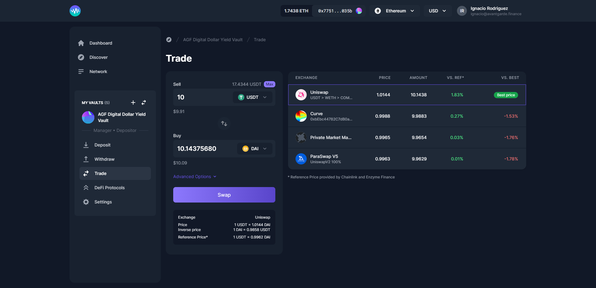

# Trade, Interact with DeFi & Farm

Now that you're all set up, you're ready to start investing! At this point, you will have 100% of your Vault's assets in the denomination currency unless you’ve [seeded your vault](https://userdocs.enzyme.finance/managers/setup/seed).

## Trading

Do you want to start trading tokens? Simply click on the Token Swap tab and you'll be able to compare prices between different DEX's and aggregators. We currently support [Uniswap](https://uniswap.org), [Paraswap](https://paraswap.io/#/?network=ethereum), [Kyber](https://kyber.network), [Synthetix](https://synthetix.io), [Curve](https://curve.fi), [0x ](https://0x.org)and soon more.

## Pools

You may decide you want to provide liquidity to AMM pools. Easy! Go to the Pools tab and you'll be able to directly deposit into [Uniswap ](https://uniswap.org)and [Curve ](https://curve.fi)pools from your Vault Manager launchpad. You will only be able to deposit into pools if you hold the relevant underlying assets.

## Staking

Curve LP tokens are automatically staked on your behalf. Going forward, Sulu’s architecture allows other types of staking to be possible (eg. governance participation).

## Yield

When interacting with protocols like [Compound](https://compound.finance), [AAVE](https://aave.com), [IDLE ](https://idle.finance/#/)strategies and [Yearn](https://yearn.finance), Enzyme users are often eligible to claim rewards. It's now possible to claim these rewards directly from the interface in the Rewards section. Go to the Rewards tab from the Vault Manager launchpad and this page will show you any rewards available that you may want to claim. For Strategies (like Idle), you can claim rewards from within the Yield tab.

When you try to claim rewards, the app will prompt you to add the token you're claiming to tracked assets that you must do before you claim. This will enable your Vault to recognise the asset, and include it in the Vault's NAV.

A couple of important notes on farming & rewards in general;

* When you have unclaimed tokens, your Vault potentially becomes a target for arbitrageurs. We would recommend that you either claim them regularly or use measures to reduce this risk (eg. limiting who can buy new shares or charging an entrance fee).
* Note that some farmable tokens can not be held in a Vault because it might not yet be supported in the Enzyme asset universe. We, therefore recommend that you use the tools we've provided to "claim & redeposit" or "claim & swap" in a single atomic transaction because of the reason stated above.
* Once you have claimed your rewards (in this example, COMP), the position won't update in your overview until either you do a trade or you receive a new deposit. However, your Vault's NAV will no longer be open to arbitrage until substantial rewards accrue.

## Borrow

Use your funds as collateral for loans, with [Compound](https://compound.finance) and [Aave](https://aave.com). In this release we introduce borrowing, you can now deposit collateral, borrow and repay your loans from Compound Finance from the Borrow tab.

#### **It takes 3 steps to borrow on Enzyme:**

1. On the Vault menu, go to the Borrow section and “Create a Debt Position”.
2. Click on the 3 dots and select “Add Collateral”. Select from the drop-down menu the asset you want to post and then specify the amount and click on “Post Collateral”.
3. Click on the 3 dots and select “Borrow asset”. Select from the drop-down menu the asset you want to borrow and then specify the amount and click on “Borrow Asset”.


**Remember, if you borrow your max available you risk a margin call.**


#### **How to repay my borrowed asset?**

On the Vault menu, go to the Borrow section and click on the 3 dots from your external position and select “Repay Assets”. Select from the drop-down menu the asset you want to repay and then specify the amount and click on “Repay Loan”.

#### **How to redeem collateral?**

On the Vault menu, go to the Borrow section and click on the 3 dots from your external position and select “Withdraw Collateral”. Select from the drop-down menu the asset you want to redeem and then specify the amount and click on “Withdraw Collateral”.

#### Important concepts to understand:

**Risk levels**

We calculate the risk level warnings based on your net collateral from your weighted average of the assets you add as collateral.

e.g. If you have $1000 worth of Aave posted (50% collateral factor) and $1000 of USDC posted (80% collateral factor) you can borrow $500 + $800 = $1300. So your net collateral factor is the amount you can borrow divided by the total collateral you've posted 1300 / 2000 = 65%.


**Yellow (High risk)**

This warning will be displayed with a safety factor of 75% of your total posted collateral.

Liquidation risk is very sensitive to price movements in your collateral, therefore we chose an arbitrary safety factor of 75%.



**Red (Margin Call)**

This warning will be displayed when the borrowed assets will immediately trigger a margin call. Therefore we have disabled the borrow asset button.


**Collateral Factor**

When using an asset as collateral, this number represents the maximum percentage that can be borrowed against it.

**Borrow Rate**

The currently yearly APY you pay to borrow an asset net of rewards. Negative rates mean you earn to borrow the net of the protocol rewards.

**Current LTV**(Loan to value)

This shows the ratio of the value of your borrowed assets to the value of your collateral assets. As this number approaches your Maximum Loan To Value, you increase your likelihood of being liquidated.

**Maximum LTV**(Loan to value)

When the value of your borrowed assets is equal to or greater than this proportion of the assets you have deposited as collateral, your positions are eligible for liquidation.

## Rewards

It can be the case that your Vault is eligible for an airdrop or otherwise has a claim on tokens that it did not receive via investment or the Enzyme-native trading integrations. As long as these assets are in the supported asset universe, there is a method to claim these tokens that mitigates the risk of a front-running attack.

1. Temporarily disable depositors into your Vault. This can be accomplished by setting both the Minimum Deposit and Maximum Deposit to 0 in the Policies tab of the Vault Manager Launchpad.
2. Claim the tokens to your Vault's address (shown on the Overview tab of your Vault's main page, in the Vault Factsheet tab at the bottom of the screen).
3. Add the asset in question to your Vault's Tracked Asset list. As a reminder, this list is automatically generated by trading activity within Enzyme, but must be manually updated for tokens that accrue to the Vault outside of any Enzyme integrations. To update this list, go to the Settings tab of your Vault Manager Launchpad and scroll down to the Add Tracked Assets tool.
4. Re-enable deposits in the Vault on the same screen as Step 1 by entering your investment limits and clicking save. If you choose to have no investment limits, simply toggle both options off and hit save.&#x20;
