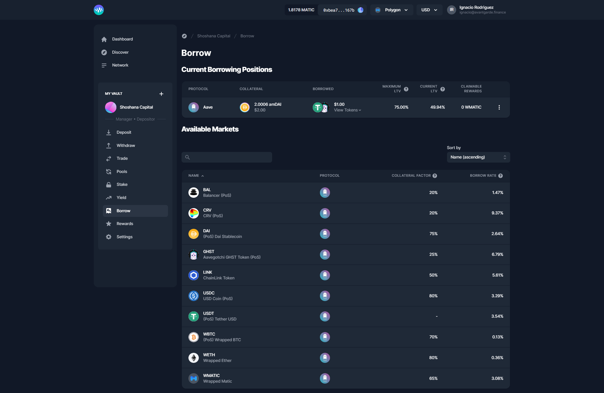

# Borrow

Use your funds as collateral for loans, with [Compound](https://compound.finance/) and [Aave](https://aave.com/). In this release we introduce borrowing, you can now deposit collateral, borrow and repay your loans from the Borrow tab.

#### **It takes 3 steps to borrow on Enzyme:**

1. On the Vault menu, go to the Borrow section and “Create a Debt Position”.
2. Click on the 3 dots and select “Add Collateral”. Select from the drop-down menu the asset you want to post and then specify the amount and click on “Post Collateral”.
3. Click on the 3 dots and select “Borrow asset”. Select from the drop-down menu the asset you want to borrow and then specify the amount and click on “Borrow Asset”.


**Remember, if you borrow your max available you risk a margin call.**


#### **How to repay my borrowed asset?**

On the Vault menu, go to the Borrow section and click on the 3 dots from your external position and select “Repay Assets”. Select from the drop-down menu the asset you want to repay and then specify the amount and click on “Repay Loan”.

#### **How to redeem collateral?**

On the Vault menu, go to the Borrow section and click on the 3 dots from your external position and select “Withdraw Collateral”. Select from the drop-down menu the asset you want to redeem and then specify the amount and click on “Withdraw Collateral”.

#### Important concepts to understand:

**Risk levels**

We calculate the risk level warnings based on your net collateral from your weighted average of the assets you add as collateral.

e.g. If you have $1000 worth of Aave posted (50% collateral factor) and $1000 of USDC posted (80% collateral factor) you can borrow $500 + $800 = $1300. So your net collateral factor is the amount you can borrow divided by the total collateral you've posted 1300 / 2000 = 65%.


**Yellow (High risk)**

This warning will be displayed with a safety factor of 75% of your total posted collateral.

Liquidation risk is very sensitive to price movements in your collateral, therefore we chose an arbitrary safety factor of 75%.



**Red (Margin Call)**

This warning will be displayed when the borrowed assets will immediately trigger a margin call. Therefore we have disabled the borrow asset button.


**Collateral Factor**

When using an asset as collateral, this number represents the maximum percentage that can be borrowed against it.

**Borrow Rate**

The currently yearly APY you pay to borrow an asset net of rewards. Negative rates mean you earn to borrow the net of the protocol rewards.

**Current LTV**(Loan to value)

This shows the ratio of the value of your borrowed assets to the value of your collateral assets. As this number approaches your Maximum Loan To Value, you increase your likelihood of being liquidated.

**Maximum LTV**(Loan to value)

When the value of your borrowed assets is equal to or greater than this proportion of the assets you have deposited as collateral, your positions are eligible for liquidation.
