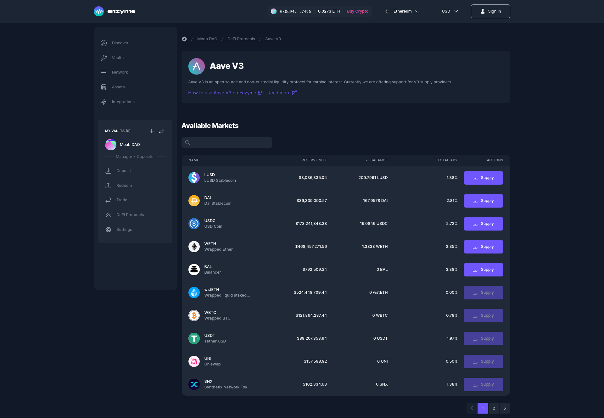

# Aave V3

<figure><figcaption></figcaption></figure>

[Aave](https://aave.com/) is an open source and non-custodial liquidity protocol for earning interest on deposits and borrowing digital assets. It enables users to deposit funds into liquidity pools and borrow assets by providing collateral. Aave also features flash loans and uses an algorithmic interest rate model.

With Aave v3, you can **Supply**, and **Claim Rewards**, with a variety of assets in **Ethereum** and **Polygon** networks.

### How to Lend on Aave v3?

1. Go to your vault menu on the left-hand side panel and click on "Defi Protocols".
2. Select "Aave v3" from the protocols list.
3. Search for the asset you wish to supply and click on "Supply".
4. Enter the amount you want to supply and click on "Supply".
5. Review the details of your transaction.
6. Confirm the transaction and sign it with your connected wallet.

### How to Redeem on Aave v3?

1. Go to your vault menu on the left-hand side panel and click on "Defi Protocols".
2. Select "Aave v3" from the protocols list.
3. On the current markets, click on "Redeem" and enter the amount you want to redeem.
4. Review the details of your transaction.
5. Confirm the transaction and sign it with your connected wallet.
