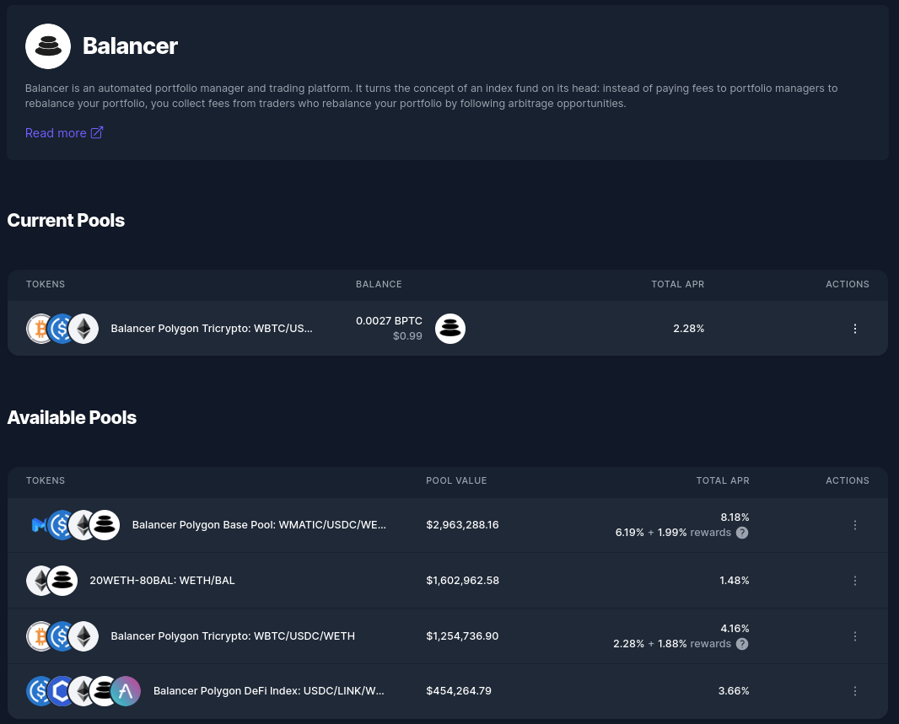

# Balancer

<figure><figcaption></figcaption></figure>

[Balancer](https://app.balancer.fi/) is a decentralized finance (DeFi) protocol that provides automated market making (AMM) services on the Ethereum blockchain and other Layer 2 networks. It allows users to create and manage custom pools of tokens, where they can earn fees by providing liquidity to the market. Balancer is designed to be a more flexible and customizable alternative to traditional AMM platforms like Uniswap.

Balancer Pools contain two or more tokens that traders can swap between. Liquidity Providers put their tokens in the pools in order to collect swap fees.&#x20;

\
Now vaults can provide liquidity to Balancer Pools and stake their Balancer Pool Tokens with Balancer.

### How to Deposit into a Balancer Pool?

1\. In your left-hand vault menu, go to “DeFi Protocols” and select Balancer.&#x20;

2\. Click on the three dots of the pool you would like to deposit assets.

3\. From the drop-down actions menu, select deposit.

4\. Enter the amount of the assets you wish to deposit.


Adding single or unbalanced assets to the pool causes the price impact to rise.


<figure><figcaption></figcaption></figure>

5\. Review the details and amounts, then click Deposit, Submit and confirm the transaction.&#x20;

### How to Stake BPT tokens?

1\. In your left-hand vault menu, go to “DeFi Protocols” and select Balancer.&#x20;

2\. Click on the three dots of the BPT you would like to Stake.

3\. From the drop-down actions menu, select Stake.

4\. Enter the BPT amount you would like to stake, then click on stake and confirm the transaction.

### How to Withdraw from a Balancer Pool?

1\. In your left-hand vault menu, go to “DeFi Protocols” and select Balancer.&#x20;

2\. Click on the three dots of the BPT you would like to Withdraw.

3\. From the drop-down actions menu, select Withdraw.

4\. Enter the BPT amount you would like to Withdraw, then click on Withdraw and confirm the transaction.


Enzyme has combined a few transactions to simplify the manager flow:

* You can **Deposit and Stake**
* You can **Withdraw and Unstake**


\
