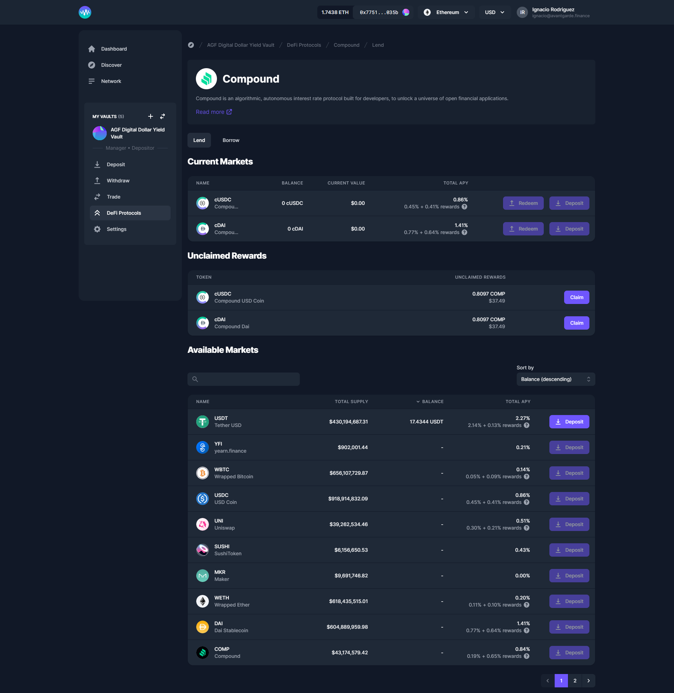

# Compound V2

[Compound](https://compound.finance/) is an algorithmic decentralized finance protocol built on the Ethereum blockchain that allows users to lend and borrow cryptocurrency assets. Enzyme enables its users to **lend and borrow** various assets **on** the **Ethereum** network using **Compound v2**.\

### How to Lend on Compound v2?

1. Go to your vault menu on the left-hand side panel and click on "Defi Protocols".
2. Select "Compound v2" from the protocols list.
3. On the Lend tab, search for the asset you wish to lend and click on "Lend".
4. Enter the amount you want to lend and click on "Lend".
5. Review the details of your transaction.
6. Confirm the transaction and sign it with your connected wallet.

### How to Redeem on Compound v2?

1. Go to your vault menu on the left-hand side panel and click on "Defi Protocols".
2. Select "Compound v2" from the protocols list.
3. On the current tab "Lend", click on "Redeem" and enter the amount you want to redeem.
4. Review the details of your transaction.
5. Confirm the transaction and sign it with your connected wallet.

### How to Borrow on Compound v2?

1. To borrow on Compound v2, go to the vault menu located on the left-hand side panel and click on "Defi Protocols".
2. From the list of protocols, choose "Compound v2".
3. In the "Borrow" tab, navigate to the "Current Borrowing Positions" section and click on the three dots. Then, select "Add Collateral".
4. Review the transaction details.
5. Confirm the transaction and sign it using your connected wallet.
6. Once you have collateral, you can select any asset from the list and click on "Borrow".
7. Enter the desired borrowing amount and click on "Borrow".
8. Review the transaction details.
9. Confirm the transaction and sign it using your connected wallet.


You must use [cTokens](https://compound.finance/docs/ctokens) as collateral to borrow on Compound. To convert regular tokens to cTokens, please lend them on [Lend](https://app.enzyme.finance/vault/0x86758fde8e8924be2b9fa440ff9d8c33a4e064a5/protocols/compound) tab.

