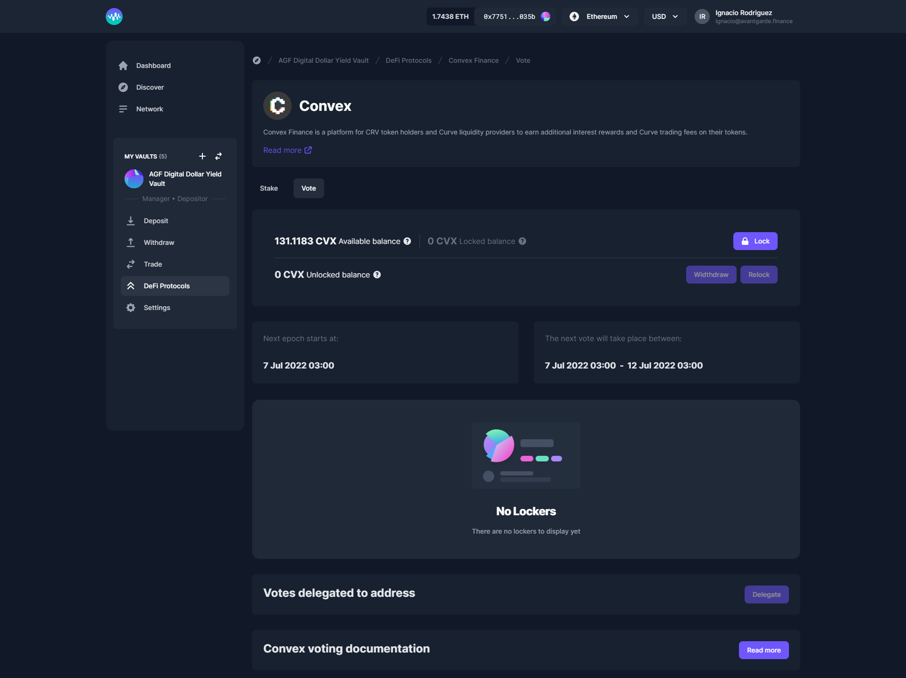
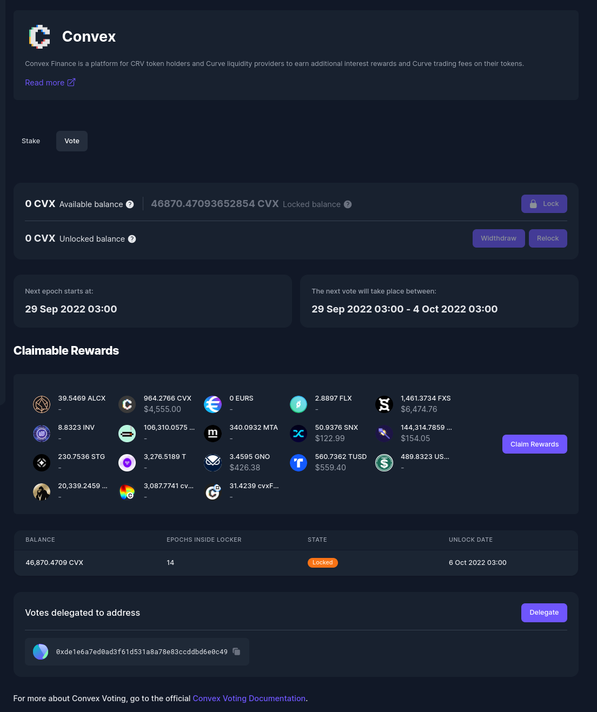

# Convex

[Convex Finance](https://www.convexfinance.com/) is a platform for CRV token holders and Curve liquidity providers to earn additional interest rewards and Curve trading fees on their tokens.

## Staking

With Convex, you can **Stake** and **provide Liquidity** to **Pools**.&#x20;

.png>)

## Lock/Delegate

CVX holders can **Lock** or **Delegate** their **CVX** via Enzyme. You can delegate your CVX to [**Votium**](https://votium.app/) or you can delegate it to a specific address.

 

<figure><figcaption></figcaption></figure>

Delegating is a separate action from locking: you don't need to delegate if you lock, nor do you need to lock if you delegate. However, if it is the first time you are Delegating, you will need to Lock your CVX first before delegating.

### How To Lock Your CVX?

1\. In your left-hand vault menu, go to “DeFi Protocols” and select Convex.&#x20;

2\. Click on the ‘Lock/Delegate’ tab.&#x20;

3\. If you have CVX available balance, click on ‘Lock’.&#x20;

4\. Input the amount of CVX you wish to lock and click on ‘Lock’.


Your CVX will be locked for 16 weeks + the time between when you lock your CVX and the next epoch start, which is every Thursday at 00:00.


### **How To Delegate CVX?**

1\. In your left-hand vault menu, go to “DeFi Protocols” and select Convex.

2\. Click on the ‘Lock/Delegate’ tab.&#x20;

3\. At the bottom of the screen click on ‘Delegate’.&#x20;

4\. You may delegate to voting or to a particular address.


You might receive many different tokens when delegating to Votium. In this case, the gas cost to claim rewards may be higher than the actual rewards. Considering this scenario, it might be better if you delegate votes to your own address and vote yourself.


### How To Relock CVX?

1\. In your left-hand vault menu, go to “DeFi Protocols” and select Convex.&#x20;

2\. Click on the ‘Lock/Delegate’ tab.&#x20;

3\. On the right-hand side of your available unlocked CVX balance click on ‘Relock’.&#x20;

4\. Input the amount of CVX you wish to relock and click on ‘Relock’.


After the 16 full weeks(epochs) have passed your CVX will be automatically unlocked, and you will need to relock or withdraw it. Otherwise, you may be subject to bounty from other users. Please check Convex documentation for more information about that [here](https://docs.convexfinance.com/convexfinance/general-information/understanding-cvx/vote-locking).


### **How To Claim Rewards?**

1\. In your left-hand vault menu, go to “DeFi Protocols” and select Convex.&#x20;

2\. Click on the ‘Lock/Delegate’ tab.&#x20;

3\. On the Claimable Rewards section, click on ‘Claim Rewards’.&#x20;

4\. You will be prompted with the tokens and amounts you will claim, then click on ‘Claim Rewards’.

### How to Withdraw?

1\. In your left-hand vault menu, go to “DeFi Protocols” and select Convex.&#x20;

2\. Click on the ‘Lock/Delegate’ tab.&#x20;

3\. On the right-hand side of your available unlocked CVX balance click on ‘Withdraw’.

### **How to Redelegate?**

1\. In your left-hand vault menu, go to “DeFi Protocols” and select Convex.&#x20;

2\. Click on the ‘Lock/Delegate’ tab.&#x20;

3\. At the bottom of the screen, on the ‘Votes delegated to address’ section, click on ‘Delegate’.&#x20;

4\. You can redelegate to Votium or any other address.
