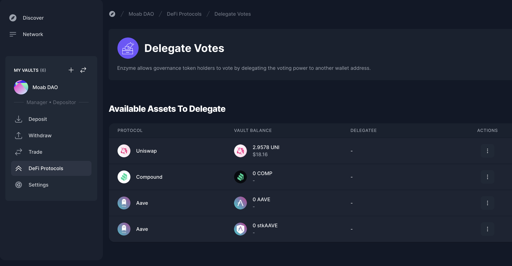

# Delegated Voting

Enzyme allows governance token holders to be able to vote. This would be done by delegating the voting power to another wallet address.

<figure><figcaption></figcaption></figure>

Currently, you are allowed to delegate and undelegate **$UNI**, **$COMP**, **$AAVE** and **$stkAAVE**.


By delegating **$AAVE** or **$stkAAVE**, you are delegating both Voting and Proposition.


### How To Delegate My Token?

1. In your left-hand vault menu, go to “DeFi Protocols” and select ‘Delegate Votes’.
2. Click on the three dots of the asset you want to delegate and click on 'Delegate’.
3. Input the delegatee address and click on ‘Delegate’

### How To Undelegate My Token?

1. In your left-hand vault menu, go to “DeFi Protocols” and select ‘Delegate Votes’.
2. Click on the three dots of the asset you want to undelegate and click on ‘Undelegate’.
3. Input the delegatee address and click on ‘Undelegate’


You will always be delegating and undelegating the full available amount of tokens.

