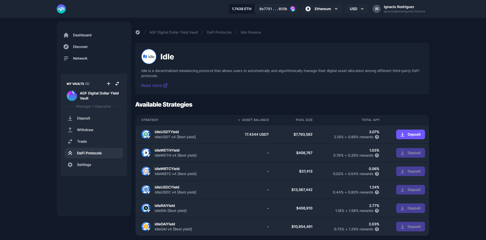

# Idle

[Idle](https://idle.finance/) is a decentralized rebalancing protocol that allows users to automatically and algorithmically manage their digital asset allocation among different third-party DeFi protocols.

Idle allows you to **provide liquidity** to the best **yield generating strategies**, on **Ethereum** and soon in **Polygon** network.
