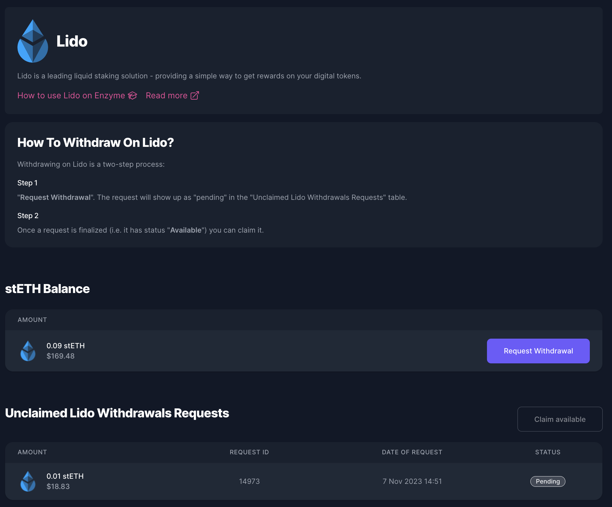

# Lido

## Lido Finance on Enzyme

Lido stands at the forefront of decentralized staking solutions, facilitating seamless staking of Ethereum, and Polygon tokens. It pools user tokens to stake with network validators and issues stTokens—representatives of the staked assets plus the staking rewards. Users hold stTokens to participate in network validation rewards, which increase their stToken balance over time. Unstaking is as straightforward as staking: users burn their stTokens and enter the network's withdrawal process to receive their stake plus rewards.

Enzyme's integration with Lido currently supports the withdrawal of stETH, meaning users can redeem their staked ETH via Lido and engage with the withdrawal waiting period as prescribed by the network's conditions.

<figure><figcaption></figcaption></figure>

### Lido Withdrawal Period

The duration of the withdrawal period is subject to various factors:

* **Queue Volume**: Withdrawals follow a First-In-First-Out system; the larger the stETH queue, the longer the wait.
* **Validator Pool Performance**: The 'Bunker mode' can slow down the process in times of network stress.
* **Beacon Chain Exit Queue**: Validators must fully exit before releasing funds, with wait times increasing with more concurrent exits.
* **Staking Activity**: The interplay between staking and unstaking affects the speed of withdrawal fulfilment.

For an in-depth understanding of the withdrawal process and duration, visit [Lido's analysis](https://blog.lido.fi/just-how-fast-are-ethereum-withdrawals-using-the-lido-protocol/).

### How to Redeem Your stETH with Enzyme

Redeeming your stETH is made straightforward with Enzyme. Is a two step process. Here's how:

1. **Request a Withdrawal**
   * Navigate to the "**DeFi Protocols"** section in your Enzyme vault.
   * Select "**Lido"** from the list of available protocols.
   * Click on "**Request Withdrawal**" and enter the amount of stETH you wish to redeem.
   * Confirm the details and then click the "**Request Withdrawal**" button.
   * Finally, sign and submit the transaction to complete the process.


Once you submit your request, the request will show up as "**Pending**" in the "**Unclaimed Lido Withdrawals**" table.&#x20;


2. **Claim a Request**
   * Navigate to the "**DeFi Protocols"** section in your Enzyme vault.
   * Select "**Lido"** from the list of available protocols.
   * On the "**Unclaimed Lido Withdrawals Table**" click on the "**Claim available**" button
   * Confirm the details and then click the "**Claim Withdrawal**" button.
   * Finally, sign and submit the transaction to complete the process.
