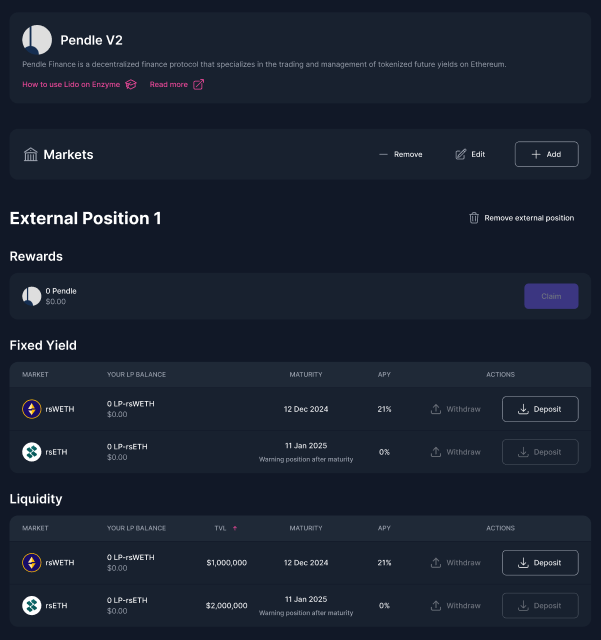

# Pendle V2

<figure><figcaption></figcaption></figure>

[Pendle](https://www.pendle.finance/) Finance is a decentralized finance protocol that specializes in the trading and management of tokenized future yields on Ethereum. It achieves this innovative approach by allowing users to separate ownership of the underlying yield-bearing asset from its future yield, creating tradable PT tokens. These PT tokens represent the future yield of various decentralized finance tokens and can be traded, leveraged, or hedged to optimize investment strategies.

This integration enables vault managers to engage in several key activities within the Pendle ecosystem directly from their Enzyme vaults. The integration allows vault managers to:

1. **Swap Stablecoin PT Tokens:** Vault managers can deposit or withdraw different PT tokens based on their assessment of market conditions and yield optimization strategies.
2. **Provide Liquidity on Pendle Pools:** By providing liquidity to Pendle’s pools, vault managers not only contribute to the market's depth but also earn transaction fees and additional rewards.
3. **Claim PENDLE & other Incentives from Liquidity Provision:** Rewarding active engagement within the Pendle Finance ecosystem.

This integration ensures that vault managers have access to all PT tokens whose underlying assets are part of the Enzyme asset universe, thereby broadening the scope for sophisticated investment maneuvers and enhanced portfolio performance.

### How to Add a Market

1. Go to your vault menu on the left-hand side panel and click on "Defi Protocols".
2. Select "**Pendle**" from the protocols list.
3. On the market view, click on "Add".&#x20;
4. Select your preferred TWAP duration.
5. Confirm the transaction and sign it with your connected wallet.


If you receive a message that the duration is not supported, please contact us at **support@enzyme.finance**.&#x20;


### How to Remove a Market

1. Go to your vault menu on the left-hand side panel and click on "Defi Protocols".
2. Select "**Pendle**" from the protocols list.
3. On the market view, click on "Remove".&#x20;
4. Confirm the transaction and sign it with your connected wallet.

### How to modify the twap duration on an existing market?


By default, the twap is set to 30 minutes as recommended by [Pendle](https://docs.pendle.finance/Developers/Integration/HowToIntegratePtAndLpOracle)


1. Go to your vault menu on the left-hand side panel and click on "Defi Protocols".
2. Select "**Pendle**" from the protocols list.
3. On the market view, click on "Edit" on the market you want to modify.
4. From the drop down list, select the new twap duration.
5. Confirm the transaction and sign it with your connected wallet.

### How to Deposit Liquidity/Fixed Yield on Pendle

1. Go to your vault menu on the left-hand side panel and click on "Defi Protocols".
2. Select "**Pendle**" from the protocols list.
3. Locate the asset you wish to supply in the table view and click on the "Deposit" button.
4. Input the amount you wish to deposit and confirm by clicking on "Deposit."
5. Confirm the transaction and sign it with your connected wallet.

### How to Withdraw Liquidity/Fixed Yield on Pendle

1. Go to your vault menu on the left-hand side panel and click on "Defi Protocols".
2. Select "**Pendle**" from the protocols list.
3. In the table view, click on the "Withdraw" button for the asset you intend to withdraw.&#x20;
4. Specify the amount you wish to withdraw and click on "Withdraw."
5. Confirm the transaction and sign it with your connected wallet.

### How to Claim Pendle Rewards

1. Go to your vault menu on the left-hand side panel and click on "Defi Protocols".
2. Select "**Pendle**" from the protocols list.
3. Locate the "Claim" button in the rewards table view and click on it.
4. Confirm the transaction and sign it with your connected wallet.
