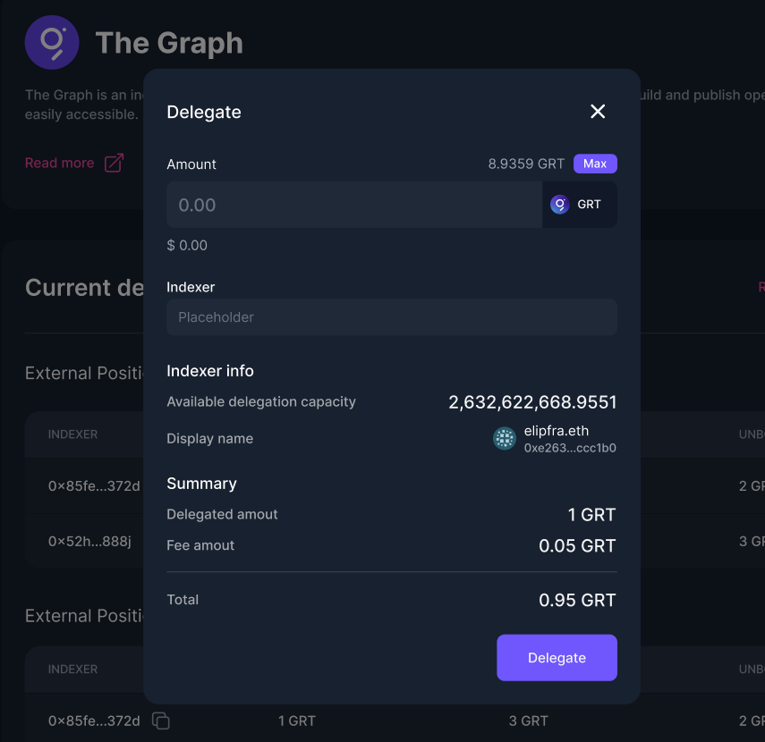
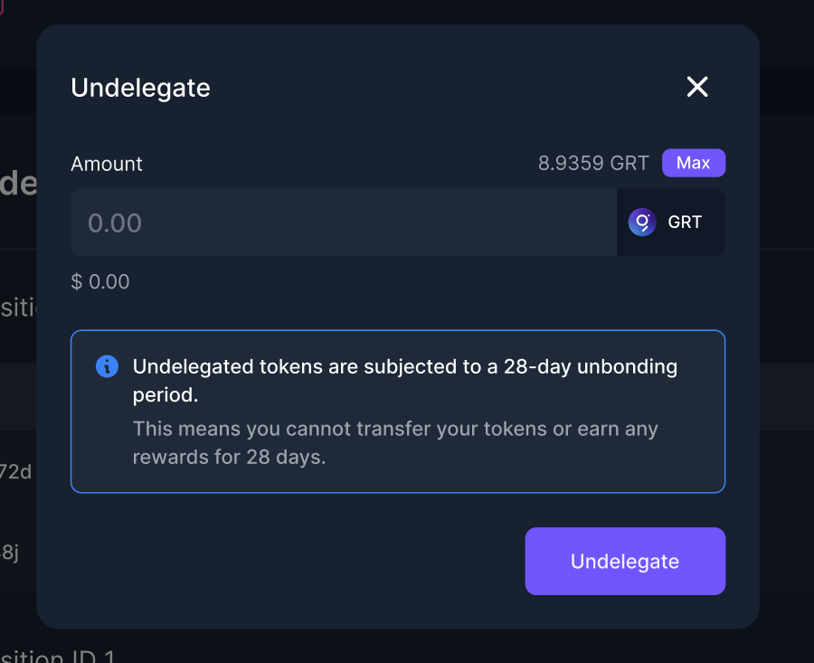

# The Graph

<figure><figcaption></figcaption></figure>

[The Graph](https://thegraph.com/en/) is an indexing protocol for querying networks like Ethereum and IPFS. Anyone can build and publish open APIs, called subgraphs, making data easily accessible.

Enzyme introduces GRT delegation, now, vaults can delegate their GRT to indexers and earn GRT rewards, which are a portion of the index fees and query fees. Delegators contribute to securing the networking without the need to run a graph node themselves.

### Before Delegating

You will need to know the indexer address to whom you will be delegating your GRT. Therefore, you should explore the indexers by clicking on ‘[Explore Indexers](https://thegraph.com/explorer/participants/indexers)’. This will take you to a list of indexers, where they display their own fees and rewards, please DYOR before selecting an indexer.

### How To Delegate GRT?

1\. In your left-hand vault menu, go to “DeFi Protocols” and select The Graph.&#x20;

2\. Click on ‘Delegate’.&#x20;

3\. Input the amount of GRT you want to delegate and the indexer address.

4\. Finally, Click on ‘Delegate’ and confirm the transaction.

<figure><figcaption></figcaption></figure>

### How to Undelegate GRT?

1\. In your left-hand vault menu, go to “DeFi Protocols” and select The Graph.&#x20;

2\. On the left-hand side of your delegated position, click on the three dots and click on ‘Undelegate’.&#x20;

3\. Enter the amount of GRT you wish to Undelegate and click on the ‘Undelegate’ button.


* Undelegated tokens are subject to a 28-day unbonding period, this means you cannot transfer your tokens or earn any rewards on these tokens for 28 days.
* If you undelegate while there is an amount of GRT that is currently unbonding, the unbonding period will reset and the whole GRT will need to wait 28 days. E.g you undelegate today 10 GRT (unbonding period 28 days). But next week you decide to undelegate 5 more GRT, then you have 15 GRT with a new unbonding period of 28 days from the moment of your last undelegated action.
* If you undelegate GRT, while having unlocked GRT, the unlocked GRT will be withdrawn to the vault.


<figure><figcaption></figcaption></figure>

### How to Redelegate GRT?

You can redelegate the GRT that has been unlocked (completed the unbonding period of 28 days).

1\. In your left-hand vault menu, go to “DeFi Protocols” and select The Graph.&#x20;

2\. On the left-hand side of your delegated position, click on the three dots and click on ‘Redelegate’.


You redelegate the whole unlocked amount, you cannot specify how much GRT you want to redelegate.


### How to Withdraw GRT?

You can withdraw the GRT that has completed the unbonding period of 28 days.

1\. In your left-hand vault menu, go to “DeFi Protocols” and select The Graph.&#x20;

2\. On the left-hand side of your delegated position, click on the three dots and click on ‘Withdraw’.

3\. Enter the amount of GRT you wish to withdraw, click on ‘Withdraw’ and confirm the transaction.

