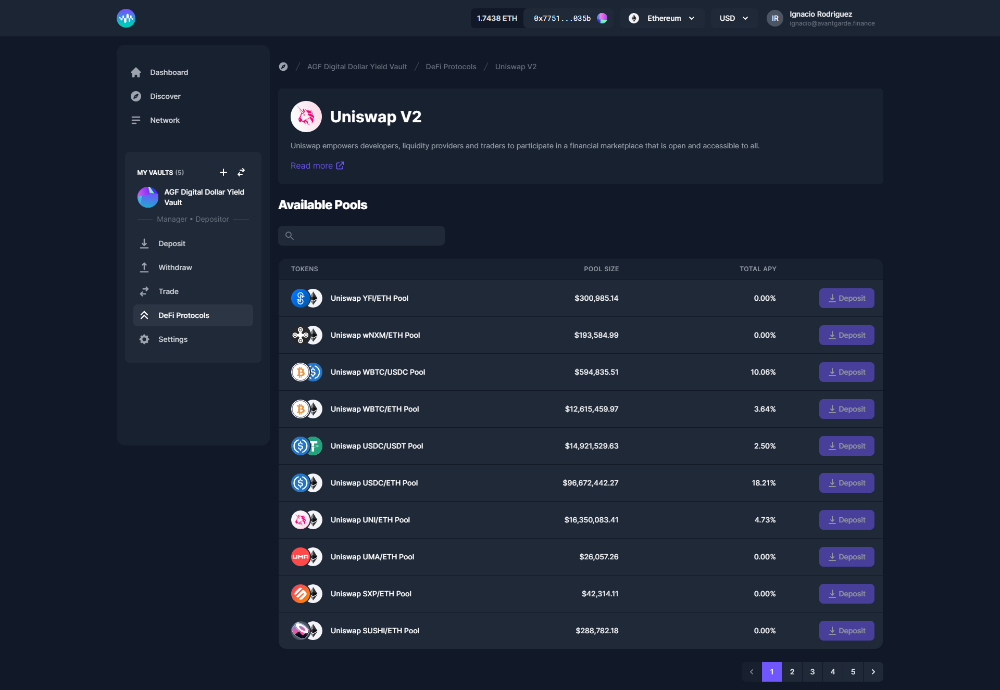

# Uniswap V2

[Uniswap V2](https://uniswap.org/) empowers developers, liquidity providers and traders to participate in a financial marketplace that is open and accessible to all.

With Uniswap V2 you can **Trade** and **provide liquidity to pools**, available on **Ethereum**.
