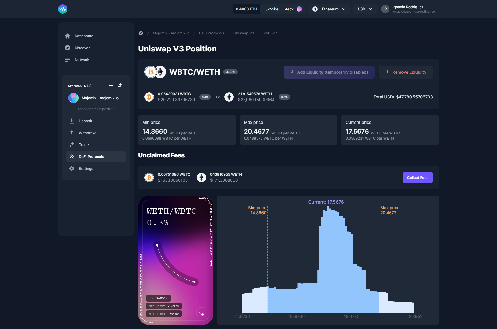

# Uniswap V3

[Uniswap V3](https://uniswap.org/) is flexible and efficient, allowing liquidity providers to allocate capital in a much more granular manner than its predecessor AMMs.

With Uniswap V3 you can **provide liquidity** within a certain price range to express directional views or increase your capital efficiency. Uniswap V3 is available on both **Ethereum** and **Polygon**.

