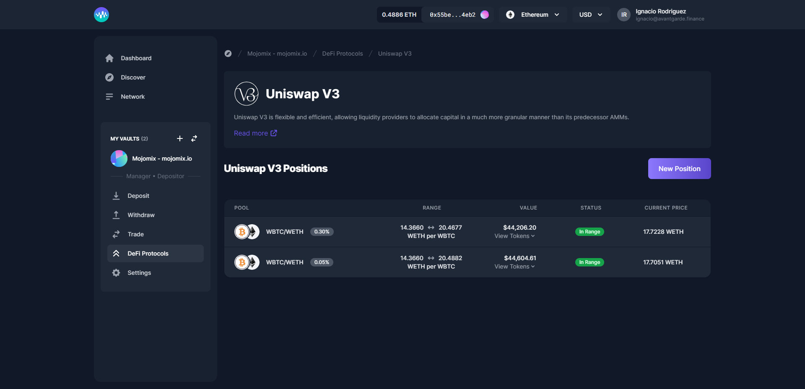

# Uniswap V3

.png>) 

[Uniswap V3](https://uniswap.org/) is flexible and efficient, allowing liquidity providers to allocate capital in a much more granular manner than its predecessor AMMs.

With Uniswap V3 you can **provide liquidity** within a certain price range to express directional views or increase your capital efficiency. Uniswap V3 is available on both **Ethereum** and **Polygon**.

### How To Provide Liquidity To Uniswap V3?

1\. In your left-hand vault menu, go to “DeFi Protocols” and select Uniswap V3.

2\. Click on 'New Position'.

<figure><figcaption></figcaption></figure>

3\. Select your pair, the fee tier, and the amounts to deposit.

4\. Then click on 'Create Position'.


You can modify your maxim and minimum price.



In the case you experience slippage problems, you can adjust your slippage threshold under the advance options, by the fault is set to 3%.


### How to Add and Remove Liquidity?

You can add and remove liquidity by simply going to the open position and selecting ‘Add/Remove Liquidity’.

### How to Collect Fees?

You can claim your fees by going to the open position and clicking on ‘Collect Fees’.
