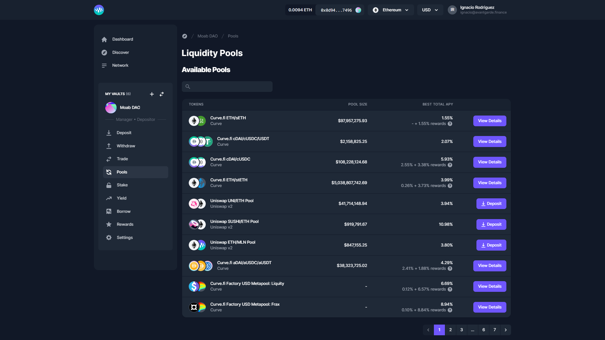

# Pools

You may decide you want to provide liquidity to AMM pools. Easy! Go to the Pools tab and you'll be able to directly deposit into [Uniswap ](https://uniswap.org)and [Curve ](https://curve.fi)pools from your Vault Manager launchpad. You will only be able to deposit into pools if you hold the relevant underlying assets.
