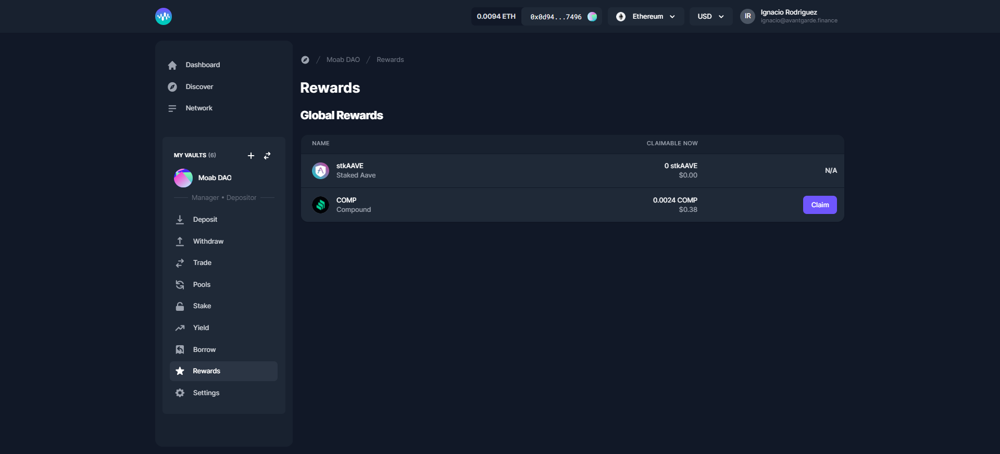

# Rewards

It can be the case that your Vault is eligible for an airdrop or otherwise has a claim on tokens that it did not receive via investment or the Enzyme-native trading integrations. As long as these assets are in the supported asset universe, there is a method to claim these tokens that mitigates the risk of a front-running attack.

1. Temporarily disable depositors into your Vault. This can be accomplished by setting both the Minimum Deposit and Maximum Deposit to 0 in the Policies tab of the Vault Manager Launchpad.
2. Claim the tokens to your Vault's address (shown on the Overview tab of your Vault's main page, in the Vault Factsheet tab at the bottom of the screen).
3. Add the asset in question to your Vault's Tracked Asset list. As a reminder, this list is automatically generated by trading activity within Enzyme, but must be manually updated for tokens that accrue to the Vault outside of any Enzyme integrations. To update this list, go to the Settings tab of your Vault Manager Launchpad and scroll down to the Add Tracked Assets tool.
4. Re-enable deposits in the Vault on the same screen as Step 1 by entering your investment limits and clicking save. If you choose to have no investment limits, simply toggle both options off and hit save.&#x20;
