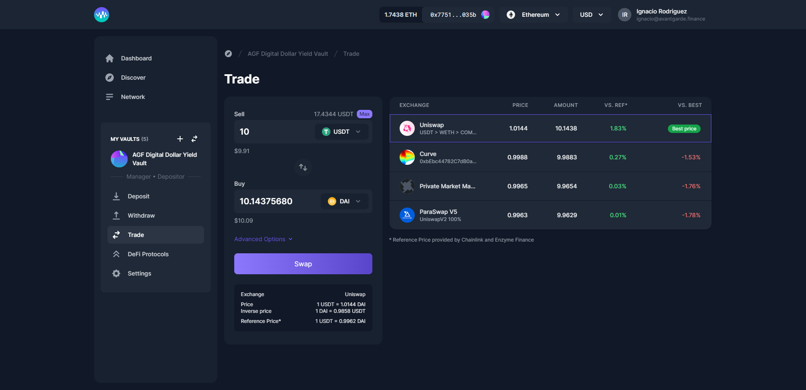

# Trade

Do you want to start trading tokens? Simply click on the Token Swap tab and you'll be able to compare prices between different DEX's and aggregators. We currently support [Uniswap](https://uniswap.org), [Paraswap](https://paraswap.io/#/?network=ethereum), [Kyber](https://kyber.network), [Synthetix](https://synthetix.io/), [Curve](https://curve.fi/), [0x ](https://0x.org/)and soon more.


Enzyme implements a 50 bps swap fee on any Paraswap trade in the Polygon network.

