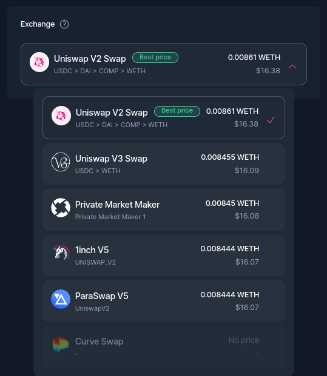
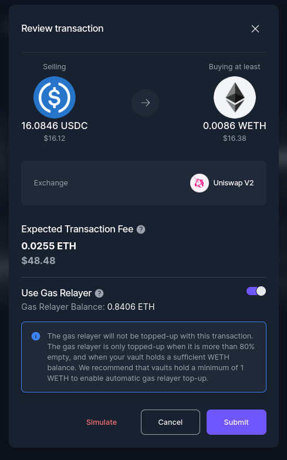

# Trade

<figure><figcaption></figcaption></figure>

Do you want to start trading tokens? Simply click on the Token Swap tab and you'll be able to get the best quote from different DEX's and aggregators. We currently support [Uniswap](https://uniswap.org), [Paraswap](https://paraswap.io/#/?network=ethereum), [Kyber](https://kyber.network), [Synthetix](https://synthetix.io/), [Curve](https://curve.fi/), [0x](https://0x.org/), [1inch](https://1inch.io/) and soon more.\

#### How to Trade?

1. In your left-hand vault menu, go to “Trade”.
2. Choose the asset you wish to sell and specify the amount.
3. Select the asset you want to purchase.
4. Initially, you will be presented with the best quote available. However, if you wish to explore quotes from other exchanges, you can click on the Exchange drop-down menu section.

<figure><figcaption></figcaption></figure>

5. Click on the "Trade" button and carefully review the transaction details.
6. Finally, click on the "Submit" button to confirm and execute the trade.

<figure><figcaption></figcaption></figure>

