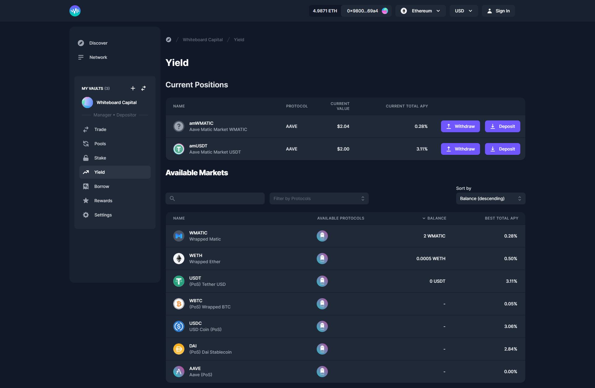

# Yield

When interacting with protocols like [Compound](https://compound.finance), [AAVE](https://aave.com), [IDLE ](https://idle.finance/#/)strategies and [Yearn](https://yearn.finance), Enzyme users are often eligible to claim rewards. It's now possible to claim these rewards directly from the interface in the Rewards section. Go to the Rewards tab from the Vault Manager launchpad and this page will show you any rewards available that you may want to claim. For Strategies (like Idle), you can claim rewards from within the Yield tab.

When you try to claim rewards, the app will prompt you to add the token you're claiming to tracked assets that you must do before you claim. This will enable your Vault to recognise the asset, and include it in the Vault's NAV.

A couple of important notes on farming & rewards in general;

* When you have unclaimed tokens, your Vault potentially becomes a target for arbitrageurs. We would recommend that you either claim them regularly or use measures to reduce this risk (eg. limiting who can buy new shares or charging an entrance fee).
* Note that some farmable tokens can not be held in a Vault because it might not yet be supported in the Enzyme asset universe. We, therefore recommend that you use the tools we've provided to "claim & redeposit" or "claim & swap" in a single atomic transaction because of the reason stated above.
* Once you have claimed your rewards (in this example, COMP), the position won't update in your overview until either you do a trade or you receive a new deposit. However, your Vault's NAV will no longer be open to arbitrage until substantial rewards accrue.
