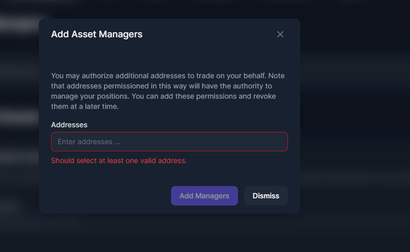

# Delegate Trading

If you are using a Gnosis Wallet. it can become slow and inefficient to pass the multisig threshold every time you need to do a trade or interact with a DeFi protocol on Enzyme. So we’ve come up with a way to delegate trading to one address. The owner of this address can be a bot, a company’s trader or an assigned group delegated by a DAO. The interesting thing about this permission is that it only gives permissions for trading and that permission can be revoked any time by the organisation.

 

In order to delegate trading to one (or more) addresses, go to Settings > Asset Management > Asset Managers, click on the button to "Add Asset Managers". Enter the Ethereum address and Add Managers and submit the transaction. Now just go back to the Gnosis Safe app and repeat the steps provided earlier. Ask the multisig owners to log in with their address, connect via Wallet Connect and sign the pending transaction.

